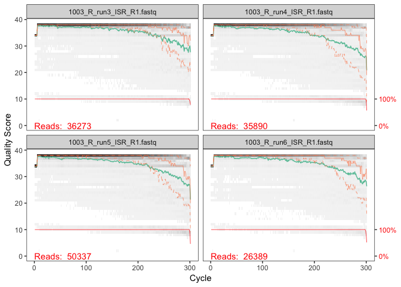
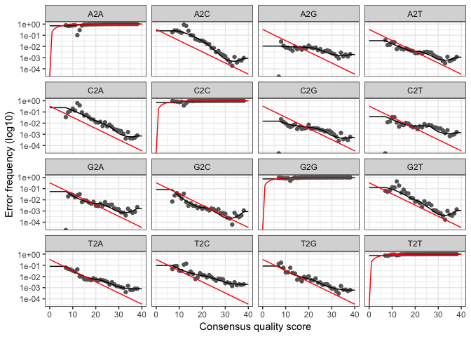

DADA2 Markdown
================
Troy Ellison
4/15/2019

Experiment Notes
================

Script for processing ISR sequences with DADA2 Final ISR Analysis for Publication Processing 30 ISR Longitudinal "Right" side samples with DADA2 to generate ASVs

 

Environment Notes
=================

R version 3.4.0 (2017-04-21) -- "You Stupid Darkness" Platform: x86\_64-apple-darwin15.6.0 (64-bit) RStudio Version 1.0.143

 

### Initial Setup

#### Set Working Directory

``` r
setwd("/Volumes/GriffenLeysLab/Troy/ISR_manuscript_markdown/DADA2")
```

#### Load Required Libraries

``` r
library(dada2); packageVersion("dada2")
```

    ## [1] '1.10.1'

``` r
library(data.table)
library(phyloseq)
```

#### Set seed and DADA2 Options

``` r
# Inspect current DADA2 options
getDadaOpt()
# Using default DADA2 options

# Set seed
set.seed(12345)
```

 

### Set Path to Fastq Files

``` r
# Assign path to unzipped forward Fastq files:
path <- "/Volumes/GriffenLeysLab/Ran/ISR_2018/ISR/ISR_long_R_fastqs" # directory of zipped forward FASTQ files
list.files(path)

# Assign full path names & verify
fnFs <- sort(list.files(path, pattern="_R1.fastq", full.names = TRUE))
fnFs

# Assign sample names & verify
sample.names <- as.vector(sapply(basename(fnFs),function(x){y <- strsplit(x,"_")[[1]];paste(y[1:3],collapse="_")}))
sample.names
```

 

### Quality Profile



 

### Filter Forward Reads

``` r
#Filter forward reads
filt_path <- file.path(path, "filtered") # Place filtered files in filtered/ subdirectory
filtFs <- file.path(filt_path, paste0(sample.names, "_F_filt.fastq.gz"))

# Forward primer used is 23SR_if, "GCCWAGGCATCCDCC" which is 15 bases
# Filter the forward reads:
# Based on quality plots, truncLen set to 295 and based on primer size trimLeft set to 15
out <- filterAndTrim(fnFs, filtFs, truncLen=295, trimLeft=15,
                     maxN=0, maxEE=2, truncQ=2, rm.phix=TRUE,
                     compress=TRUE, multithread=TRUE)

# View filtering stats
out
```

 

### Learn Error Rates

``` r
# Learn Error rates
errF <- learnErrors(filtFs, multithread=TRUE)
```

 

### Error Plot



 

### Dereplicate and Denoise

``` r
#Dereplicate the filtered fastq files:
derepFs <- derepFastq(filtFs, verbose=TRUE)

# Name the derep-class objects by the sample names
names(derepFs) <- sample.names

# De-noise sequences & inspect object
dadaFs <- dada(derepFs, err=errF, multithread=TRUE)
dadaFs[[1]]
```

 

### Make Sequence Table and Remove Chimeras

``` r
#Make sequence table without merging
seqtabF <- makeSequenceTable(dadaFs)
dim(seqtabF)
#[1]   30 2250

seqtabF.nochim <- removeBimeraDenovo(seqtabF, method="consensus", multithread=TRUE, verbose=TRUE)
```

    ## Identified 241 bimeras out of 2266 input sequences.

``` r
# Identified 238 bimeras out of 2250 input sequences.
dim(seqtabF.nochim)
#[1]   30 2012

sum(seqtabF.nochim)/sum(seqtabF)
# [1] 0.9793831

# Inspect distribution of sequence lengths
table(nchar(getSequences(seqtabF.nochim)))
# 280 2012
```

 

### Generate DADA2 Stats

``` r
getN <- function(x) sum(getUniques(x))
track <- cbind(out, sapply(dadaFs, getN), rowSums(seqtabF), rowSums(seqtabF.nochim))
colnames(track) <- c("input", "filtered", "denoised", "tabled","nochim")
rownames(track) <- sample.names
ISR_stats <- as.data.frame(track)
write.table(ISR_stats, file="ISR_DADA2stats.txt", sep="\t", quote=F, col.names = NA)

#Making ASV table:
atab <- otu_table(seqtabF.nochim, taxa_are_rows=FALSE)
colnames(atab) <- paste0("seq", seq(ncol(atab)))
ISR_long_R.atab <- as.data.frame(atab)

dim(ISR_long_R.atab)
```

    ## [1]   30 2025

``` r
#[1]   30 2012

write.table(ISR_long_R.atab, file="ISR_long_R_ASVs.txt", sep="\t", quote=F, col.names = NA)
```

#### Meta File

``` r
# Rename for analysis:
rownames(ISR_long_R.atab) <- sub("_R_run3", "_T1", rownames(ISR_long_R.atab))
rownames(ISR_long_R.atab) <- sub("_R_run4", "_T2", rownames(ISR_long_R.atab))
rownames(ISR_long_R.atab) <- sub("_R_run5", "_T3", rownames(ISR_long_R.atab))
rownames(ISR_long_R.atab) <- sub("_R_run6", "_T4", rownames(ISR_long_R.atab))
rownames(ISR_long_R.atab) <- sub("_R_run7", "_T5", rownames(ISR_long_R.atab))
rownames(ISR_long_R.atab) <- sub("_R_run8", "_T6", rownames(ISR_long_R.atab))

rownames(ISR_long_R.atab) <- sub("1003_", "S1_", rownames(ISR_long_R.atab))
rownames(ISR_long_R.atab) <- sub("1004_", "S2_", rownames(ISR_long_R.atab))
rownames(ISR_long_R.atab) <- sub("1006_", "S3_", rownames(ISR_long_R.atab))
rownames(ISR_long_R.atab) <- sub("1007_", "S4_", rownames(ISR_long_R.atab))
rownames(ISR_long_R.atab) <- sub("2002_", "S5_", rownames(ISR_long_R.atab))

# Make meta file
meta <- as.data.frame(row.names(ISR_long_R.atab))
row.names(meta) <- row.names(ISR_long_R.atab)
colnames(meta) <- "sample"
meta$subject <- sapply(strsplit(as.character(meta$sample), "_"),  '[', 1)
meta$run <- sapply(strsplit(as.character(meta$sample), "_"),  '[', 2)
meta$subject <- as.factor(meta$subject)
meta$run <- as.factor(meta$run)
```

 

### Output Fasta File

``` r
# Extracting sequences:
ISR_long_R_seqs <- colnames(seqtabF.nochim)

# Write seqs file as output fasta file:
for (i in 1:length(ISR_long_R_seqs)){
  sink("ISR_long_R.fasta",append = T)  # Append is set to true!
  cat(paste(">",colnames(ISR_long_R.atab)[i],sep=""),ISR_long_R_seqs[i],sep="\n")
  sink()
}
```
