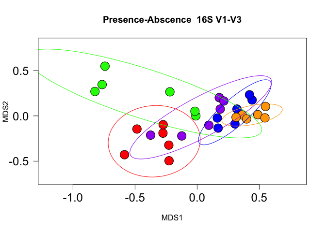

ISR MS Analysis Demo
================
Chiranjit Mukherjee
12/10/2019

Notes
-----

This markdown demonstrates how the visualizations for the ISR Manuscript (<https://microbiomejournal.biomedcentral.com/articles/10.1186/s40168-018-0535-z>) were created. Environment Notes: R version 3.4.0 (2017-04-21) -- "You Stupid Darkness" Platform: x86\_64-apple-darwin15.6.0 (64-bit) RStudio Version 1.0.143

### Load Required Libraries

``` r
library(plotrix)
library(GUniFrac) #Rarefy
library(gplots) #heatmap
library(reshape2) #decostand
library(data.table) #setDT
library(Biostrings) #readDNAstringset
library(knitr)
```

#### Load custom functions required for generating analysis and figures

``` r
source("ISR_Custom_functions.R")
```

#### Load input files

``` r
# Load ASV/OTU tables
ISR_long_R.atab <- read.table(file="Input_files/ISR_ASVs.txt", sep="\t", header = T) # Load ISR DADA2 ASV table for the 30 samples
V12_long_R.atab <- read.table(file="Input_files/V12_ASVs.txt", sep="\t", header = T) # Load V12 DADA2 ASV table for the 30 samples
V13_long_R.core <- read.table(file="Input_files/V13_core_otus.txt", sep="\t", header = T) # Load V13 Core-mapped OTU table for the 30 samples

# Load metadata
meta <- read.table(file="Input_files/ISR_metadata.txt", sep="\t", header = T) # Load meta data table for the 30 samples
meta$level <- as.factor("level") # Set levels

# Input actual sampling time differences
time_diff <- read.table(file="Input_files/ISR_timeppoints.txt", sep="\t", header = T)

# Load BLAST results: 
ISR_blastres <- read.table(file="Input_files/ISR_blastres.txt", sep="\t", header = T) # Results from running BLAST search of the ISR ASVs against ISR database Jan 2018 version

# Load ISR database taxonomy file
ISR_db_tax <- read.table(file="Input_files/ISR_db_tax.txt", sep="\t", header = T)
```

<br> <br>

Data Analysis Steps
-------------------

<br>

#### Generate Plots for CORE Species OTU Resolution

``` r
V13.plots <- ISR_dist_plots(V13_long_R.core, meta, "16S V1-V3", 1.2,0.8,0.7,0.8)
```

    ## Run 0 stress 0.1143716 
    ## Run 1 stress 0.1208497 
    ## Run 2 stress 0.1249084 
    ## Run 3 stress 0.1225294 
    ## Run 4 stress 0.1277839 
    ## Run 5 stress 0.1208501 
    ## Run 6 stress 0.1329712 
    ## Run 7 stress 0.1160349 
    ## Run 8 stress 0.1208287 
    ## Run 9 stress 0.1139151 
    ## ... New best solution
    ## ... Procrustes: rmse 0.01458331  max resid 0.0516686 
    ## Run 10 stress 0.1176146 
    ## Run 11 stress 0.1247688 
    ## Run 12 stress 0.1223488 
    ## Run 13 stress 0.1247688 
    ## Run 14 stress 0.1296387 
    ## Run 15 stress 0.1277762 
    ## Run 16 stress 0.1143722 
    ## ... Procrustes: rmse 0.01512355  max resid 0.05205142 
    ## Run 17 stress 0.1178335 
    ## Run 18 stress 0.1164416 
    ## Run 19 stress 0.1241918 
    ## Run 20 stress 0.1178336 
    ## Run 21 stress 0.1150238 
    ## Run 22 stress 0.1139151 
    ## ... New best solution
    ## ... Procrustes: rmse 5.298068e-05  max resid 0.0001579802 
    ## ... Similar to previous best
    ## *** Solution reached



    ## Analysis of Variance Table
    ##      Df  Sum Sq Mean Sq F value
    ## tp2m  1 0.03269 0.03269   5.796


    ## Bootstrap (r = 0.5)... Done.
    ## Bootstrap (r = 0.6)... Done.
    ## Bootstrap (r = 0.7)... Done.
    ## Bootstrap (r = 0.8)... Done.
    ## Bootstrap (r = 0.9)... Done.
    ## Bootstrap (r = 1.0)... Done.
    ## Bootstrap (r = 1.1)... Done.
    ## Bootstrap (r = 1.2)... Done.
    ## Bootstrap (r = 1.3)... Done.
    ## Bootstrap (r = 1.4)... Done.


``` r
V12.plots <- ISR_dist_plots(V12_long_R.atab, meta,"16S DADA2", 1.8,1.8,1.8,1.9)
```

    ## Run 0 stress 0.1871709 
    ## Run 1 stress 0.2494797 
    ## Run 2 stress 0.187171 
    ## ... Procrustes: rmse 6.988536e-05  max resid 0.0001532973 
    ## ... Similar to previous best
    ## Run 3 stress 0.1871711 
    ## ... Procrustes: rmse 0.0001219927  max resid 0.000301542 
    ## ... Similar to previous best
    ## Run 4 stress 0.1935726 
    ## Run 5 stress 0.1871709 
    ## ... New best solution
    ## ... Procrustes: rmse 2.320569e-05  max resid 6.668534e-05 
    ## ... Similar to previous best
    ## Run 6 stress 0.2003252 
    ## Run 7 stress 0.1935798 
    ## Run 8 stress 0.2155245 
    ## Run 9 stress 0.1903077 
    ## Run 10 stress 0.1871709 
    ## ... New best solution
    ## ... Procrustes: rmse 2.296789e-05  max resid 6.029521e-05 
    ## ... Similar to previous best
    ## Run 11 stress 0.2003259 
    ## Run 12 stress 0.2544579 
    ## Run 13 stress 0.1939475 
    ## Run 14 stress 0.2516024 
    ## Run 15 stress 0.2329238 
    ## Run 16 stress 0.2580081 
    ## Run 17 stress 0.2003274 
    ## Run 18 stress 0.2681607 
    ## Run 19 stress 0.1871709 
    ## ... Procrustes: rmse 3.145111e-05  max resid 8.170188e-05 
    ## ... Similar to previous best
    ## Run 20 stress 0.193575 
    ## *** Solution reached


    ## Analysis of Variance Table
    ##      Df   Sum Sq  Mean Sq F value
    ## tp2m  1 0.030045 0.030045  4.6201


    ## Bootstrap (r = 0.5)... Done.
    ## Bootstrap (r = 0.6)... Done.
    ## Bootstrap (r = 0.7)... Done.
    ## Bootstrap (r = 0.8)... Done.
    ## Bootstrap (r = 0.9)... Done.
    ## Bootstrap (r = 1.0)... Done.
    ## Bootstrap (r = 1.1)... Done.
    ## Bootstrap (r = 1.2)... Done.
    ## Bootstrap (r = 1.3)... Done.
    ## Bootstrap (r = 1.4)... Done.


``` r
ISR.plots <- ISR_dist_plots(ISR_long_R.atab, meta,  "ISR", 1.5,1,0.9,0.9)
```

    ## Run 0 stress 0.1541504 
    ## Run 1 stress 0.2623827 
    ## Run 2 stress 0.154084 
    ## ... New best solution
    ## ... Procrustes: rmse 0.004797611  max resid 0.01857571 
    ## Run 3 stress 0.154084 
    ## ... Procrustes: rmse 6.163547e-06  max resid 2.020321e-05 
    ## ... Similar to previous best
    ## Run 4 stress 0.154084 
    ## ... New best solution
    ## ... Procrustes: rmse 4.646426e-06  max resid 1.561331e-05 
    ## ... Similar to previous best
    ## Run 5 stress 0.154084 
    ## ... New best solution
    ## ... Procrustes: rmse 3.299095e-06  max resid 1.156066e-05 
    ## ... Similar to previous best
    ## Run 6 stress 0.1541504 
    ## ... Procrustes: rmse 0.004797821  max resid 0.01856551 
    ## Run 7 stress 0.1541474 
    ## ... Procrustes: rmse 0.003348117  max resid 0.01360553 
    ## Run 8 stress 0.154084 
    ## ... Procrustes: rmse 6.531994e-06  max resid 1.644984e-05 
    ## ... Similar to previous best
    ## Run 9 stress 0.1541466 
    ## ... Procrustes: rmse 0.003107085  max resid 0.01261607 
    ## Run 10 stress 0.1541472 
    ## ... Procrustes: rmse 0.003211283  max resid 0.01303744 
    ## Run 11 stress 0.1541504 
    ## ... Procrustes: rmse 0.004798415  max resid 0.01857098 
    ## Run 12 stress 0.1541504 
    ## ... Procrustes: rmse 0.004797948  max resid 0.01856717 
    ## Run 13 stress 0.154084 
    ## ... New best solution
    ## ... Procrustes: rmse 1.987225e-06  max resid 5.102674e-06 
    ## ... Similar to previous best
    ## Run 14 stress 0.154084 
    ## ... Procrustes: rmse 1.352534e-05  max resid 4.777124e-05 
    ## ... Similar to previous best
    ## Run 15 stress 0.154084 
    ## ... Procrustes: rmse 2.03384e-06  max resid 4.277063e-06 
    ## ... Similar to previous best
    ## Run 16 stress 0.2342491 
    ## Run 17 stress 0.1541504 
    ## ... Procrustes: rmse 0.004799933  max resid 0.0185693 
    ## Run 18 stress 0.154084 
    ## ... Procrustes: rmse 8.471822e-06  max resid 2.929848e-05 
    ## ... Similar to previous best
    ## Run 19 stress 0.209028 
    ## Run 20 stress 0.154084 
    ## ... Procrustes: rmse 8.775379e-06  max resid 2.465887e-05 
    ## ... Similar to previous best
    ## *** Solution reached


    ## Analysis of Variance Table
    ##      Df   Sum Sq  Mean Sq F value
    ## tp2m  1 0.062867 0.062867  14.176


    ## Bootstrap (r = 0.5)... Done.
    ## Bootstrap (r = 0.6)... Done.
    ## Bootstrap (r = 0.7)... Done.
    ## Bootstrap (r = 0.8)... Done.
    ## Bootstrap (r = 0.9)... Done.
    ## Bootstrap (r = 1.0)... Done.
    ## Bootstrap (r = 1.1)... Done.
    ## Bootstrap (r = 1.2)... Done.
    ## Bootstrap (r = 1.3)... Done.
    ## Bootstrap (r = 1.4)... Done.


#### Random Forest Accuracy Rates

``` r
ISR_random_forest(V13.plots$rar_prab)
```

    ## [1] 96.66667

``` r
ISR_random_forest(V12.plots$rar_prab)
```

    ## [1] 96.66667

``` r
ISR_random_forest(ISR.plots$rar_prab)
```

    ## [1] 100

### Plotting Barplots of Richness and Boxplot of Mean Centroid Distances

#### Statistical Calculations

``` r
# Calculating betadispersion
mod.v13 <- betadisper(V13.plots$prab_bcdist, factor(meta$level))
mod.v12 <- betadisper(V12.plots$prab_bcdist, factor(meta$level))
mod.ISR <- betadisper(ISR.plots$prab_bcdist, factor(meta$level))

# Statistical Testing
wilcox.test(mod.v13$distances, mod.v12$distances) 
```

    ## 
    ##  Wilcoxon rank sum test
    ## 
    ## data:  mod.v13$distances and mod.v12$distances
    ## W = 16, p-value = 1.547e-14
    ## alternative hypothesis: true location shift is not equal to 0

``` r
wilcox.test(mod.v12$distances, mod.ISR$distances) 
```

    ## 
    ##  Wilcoxon rank sum test
    ## 
    ## data:  mod.v12$distances and mod.ISR$distances
    ## W = 254, p-value = 0.00336
    ## alternative hypothesis: true location shift is not equal to 0

``` r
wilcox.test(mod.v13$distances, mod.ISR$distances) 
```

    ## 
    ##  Wilcoxon rank sum test
    ## 
    ## data:  mod.v13$distances and mod.ISR$distances
    ## W = 0, p-value < 2.2e-16
    ## alternative hypothesis: true location shift is not equal to 0

``` r
# Calculating Shared OTUs/ASVs with custom function otu_stats:
V13_sub <- otu_stats(V13.plots$rar_prab)
V12_sub <- otu_stats(V12.plots$rar_prab)
ISR_sub <- otu_stats(ISR.plots$rar_prab)
```

#### Combining Stats

``` r
pipeline_stats <- rbind.data.frame(V13_sub$stats,V12_sub$stats, ISR_sub$stats)
colnames(pipeline_stats) <- c("Unique.OTUs.ASVs","Shared.OTUs.ASVs","total")
pipeline_stats$Pipeline <- c("16S OTUs","16S ASVs ","ISR ASVs")

# Set par for plots
par(mar = c(13,5,4,4), mgp=c(3.5, 0.5, 0)) # barplot
par(mfrow=c(1,4))
```

### Generate Barplots

``` r
par(mar = c(8,6,3,1), mgp=c(4, 0.5, 0.5)) # barplot
barplot(pipeline_stats$total, names.arg = pipeline_stats$Pipeline,
        col=c("#424E5C","#365BB7","#5B1A8E"),las=2, 
        cex.lab=1.75,cex.names = 1.5,cex.axis = 1.2,
        ylab = "Total # of Sequence Variantss")
```


``` r
par(mar = c(8,6,3,1), mgp=c(4, 0.5, 0.5)) # barplot
barplot(pipeline_stats$Unique.OTUs.ASVs, names.arg = pipeline_stats$Pipeline,
        col=c("#424E5C","#365BB7","#5B1A8E"),las=2, 
        cex.lab=1.75,cex.names = 1.5, cex.axis = 1.2,
        ylab = "% Variants Unique to 1 Subject")
```


``` r
par(mar = c(8,6,3,1), mgp=c(4, 0.5, 0.5)) # barplot
barplot(pipeline_stats$Shared.OTUs.ASVs, names.arg = pipeline_stats$Pipeline,
        col=c("#424E5C","#365BB7","#5B1A8E"),las=2, 
        cex.lab=1.75,cex.names = 1.5,cex.axis = 1.2,
        ylab = "% Variants Shared by 5 Subjects")
```


### Generate Boxplots

``` r
par(mar = c(7,6,1,1), mgp=c(4, 0.5, 0.5)) # barplot
boxplot(mod.v13$distances, mod.v12$distances, mod.ISR$distances,
        ylim=c(0.2,0.7), col=c("#424E5C","#365BB7","#5B1A8E"),
        xaxt="n",
        boxwex = 0.25,
        cex.lab=1.75, cex.axis=1.2,cex.names = 1.5,
        frame=F,
        #main="Comparison of Pipelines",
        ylab="Centroid Distances")
axis(side = 1, at = c(1,2,3), tck=-0.01,
     labels = c("16S Ref.","16S HR ","ISR HR"), 
     cex.axis=1.5,
     las=2)


# 16S Sp vs 16S dada2
# create the y coordinate of the line
y <- 0.68
# set an offset for tick lengths
offset <- 0.005
# draw first horizontal line
lines(c(1,2),c(y, y))
# draw ticks
lines(c(1,1),c(y, y-offset))
lines(c(2,2),c(y, y-offset))
# draw asterics
text(1.5,y+offset,"****")

# 16S DADA2 vs ISR
# create the y coordinate of the line
y <- 0.69
# draw first horizontal line
lines(c(2,3),c(y, y))
# draw ticks
lines(c(2,2),c(y, y-offset))
lines(c(3,3),c(y, y-offset))
# draw asterics
text(2.5,y+offset,"**")

# 16S Species vs ISR
# create the y coordinate of the line
y <- 0.70
# draw first horizontal line
lines(c(1,3),c(y, y))
# draw ticks
lines(c(1,1),c(y, y-offset))
lines(c(3,3),c(y, y-offset))
# draw asterics
text(2,y+offset,"****")
```


### Subspecies Level Analysis

#### Step1: Select ISR ASVs present in &gt;1 sample

``` r
# Select ISR ASVs present in >1 sample:
ISR_long_R.atab.prab <- data.frame((ISR_long_R.atab > 0)*1)
ISR_long_R.atab.prab.sel <- ISR_long_R.atab.prab[,colSums(ISR_long_R.atab.prab) > 1] # 1000 sequences selected
ISR_blast_accnos <- colnames(ISR_long_R.atab.prab.sel)

ISR_long_R.atab.sel <- ISR_long_R.atab[,colnames(ISR_long_R.atab) %in% colnames(ISR_long_R.atab.prab.sel)] # 30 x 1000, raw counts

# Used these selected sequences for BLAST against ISR database
```

### Processing Blast results:

``` r
# Assign species level taxonomy
ISR_blastres$otu1 <- ISR_db_tax$CORE_otu[match(ISR_blastres$db1,ISR_db_tax$isr_db_id)]
ISR_blastres$otu2 <- ISR_db_tax$CORE_otu[match(ISR_blastres$db2,ISR_db_tax$isr_db_id)]

# Filter Blast matches with score > 0.1
ISR_blast_matches <- ISR_blastres[ISR_blastres$score1 > 0.1,]

# Verifying ISR database BLAST validity
same_blast_scores <- ISR_blast_matches[(ISR_blast_matches$score1 == ISR_blast_matches$score2),] 
blast_mismatches <- same_blast_scores[same_blast_scores$otu1 != same_blast_scores$otu2,]
length(blast_mismatches)
```

    ## [1] 8

### Selected 90% as cutoff for BLAST Matches

``` r
# Subsetting BLAST matches for scores >= 90%
ISR_matches_over90 <- ISR_blast_matches[ISR_blast_matches$score1 >= 0.90,] 
ISR_matches_over90 <- ISR_matches_over90[,c(1:3, 7)]

# Subsetting ISR pivot for BLAST matches at 90%
ISR_long_R.matches <- ISR_long_R.atab[,colnames(ISR_long_R.atab) %in% row.names(ISR_matches_over90)] 

# NMDS with only matches over 90
ISR_blast_matches.plots <- ISR_dist_plots(ISR_long_R.matches,meta,"ISR BLAST Matches",2.9,1.9,1.9,1.9)
```

    ## Run 0 stress 0.1654861 
    ## Run 1 stress 0.1654861 
    ## ... New best solution
    ## ... Procrustes: rmse 2.7595e-05  max resid 0.0001115694 
    ## ... Similar to previous best
    ## Run 2 stress 0.1654862 
    ## ... Procrustes: rmse 2.752144e-05  max resid 8.212013e-05 
    ## ... Similar to previous best
    ## Run 3 stress 0.1654861 
    ## ... Procrustes: rmse 4.233511e-06  max resid 1.130436e-05 
    ## ... Similar to previous best
    ## Run 4 stress 0.1654861 
    ## ... Procrustes: rmse 1.644167e-05  max resid 6.765061e-05 
    ## ... Similar to previous best
    ## Run 5 stress 0.1654861 
    ## ... Procrustes: rmse 3.512884e-06  max resid 6.973406e-06 
    ## ... Similar to previous best
    ## Run 6 stress 0.1654861 
    ## ... New best solution
    ## ... Procrustes: rmse 3.623099e-06  max resid 9.911632e-06 
    ## ... Similar to previous best
    ## Run 7 stress 0.1654861 
    ## ... Procrustes: rmse 1.439601e-05  max resid 6.358404e-05 
    ## ... Similar to previous best
    ## Run 8 stress 0.2145227 
    ## Run 9 stress 0.1654862 
    ## ... Procrustes: rmse 3.867261e-05  max resid 0.0001580986 
    ## ... Similar to previous best
    ## Run 10 stress 0.1654861 
    ## ... Procrustes: rmse 6.787882e-06  max resid 2.90333e-05 
    ## ... Similar to previous best
    ## Run 11 stress 0.1654861 
    ## ... New best solution
    ## ... Procrustes: rmse 9.939421e-07  max resid 2.102114e-06 
    ## ... Similar to previous best
    ## Run 12 stress 0.1654861 
    ## ... Procrustes: rmse 4.473712e-05  max resid 0.0001659955 
    ## ... Similar to previous best
    ## Run 13 stress 0.1654861 
    ## ... Procrustes: rmse 2.246681e-06  max resid 5.032003e-06 
    ## ... Similar to previous best
    ## Run 14 stress 0.1838207 
    ## Run 15 stress 0.1654861 
    ## ... Procrustes: rmse 1.459647e-06  max resid 3.223385e-06 
    ## ... Similar to previous best
    ## Run 16 stress 0.1654861 
    ## ... Procrustes: rmse 2.743386e-05  max resid 6.072701e-05 
    ## ... Similar to previous best
    ## Run 17 stress 0.1654861 
    ## ... Procrustes: rmse 3.910074e-06  max resid 1.323159e-05 
    ## ... Similar to previous best
    ## Run 18 stress 0.1654861 
    ## ... Procrustes: rmse 1.424316e-05  max resid 5.925262e-05 
    ## ... Similar to previous best
    ## Run 19 stress 0.1654862 
    ## ... Procrustes: rmse 3.522413e-05  max resid 9.00689e-05 
    ## ... Similar to previous best
    ## Run 20 stress 0.1654862 
    ## ... Procrustes: rmse 3.33971e-05  max resid 9.118929e-05 
    ## ... Similar to previous best
    ## *** Solution reached


    ## Warning in melt(x): The melt generic in data.table has been passed a
    ## matrix and will attempt to redirect to the relevant reshape2 method;
    ## please note that reshape2 is deprecated, and this redirection is now
    ## deprecated as well. To continue using melt methods from reshape2 while both
    ## libraries are attached, e.g. melt.list, you can prepend the namespace like
    ## reshape2::melt(x). In the next version, this warning will become an error.


    ## Analysis of Variance Table
    ##      Df  Sum Sq Mean Sq F value
    ## tp2m  1 0.17781 0.17781  18.694


    ## Bootstrap (r = 0.5)... Done.
    ## Bootstrap (r = 0.6)... Done.
    ## Bootstrap (r = 0.7)... Done.
    ## Bootstrap (r = 0.8)... Done.
    ## Bootstrap (r = 0.9)... Done.
    ## Bootstrap (r = 1.0)... Done.
    ## Bootstrap (r = 1.1)... Done.
    ## Bootstrap (r = 1.2)... Done.
    ## Bootstrap (r = 1.3)... Done.
    ## Bootstrap (r = 1.4)... Done.


NMDS and Hclust looks similar to the one made with all ASVs

#### Making Strain Table

``` r
# Making CORE OTU based Counts table
ISR_long_R.matches.melt <- melt(t(ISR_long_R.matches))
```

    ## Warning in melt(t(ISR_long_R.matches)): The melt generic in data.table has
    ## been passed a matrix and will attempt to redirect to the relevant reshape2
    ## method; please note that reshape2 is deprecated, and this redirection is
    ## now deprecated as well. To continue using melt methods from reshape2 while
    ## both libraries are attached, e.g. melt.list, you can prepend the namespace
    ## like reshape2::melt(t(ISR_long_R.matches)). In the next version, this
    ## warning will become an error.

``` r
ISR_long_R.matches.melt$otu <- ISR_matches_over90$otu1[match(ISR_long_R.matches.melt$Var1,row.names(ISR_matches_over90))]
ISR_long_R.338.counts <- dcast(ISR_long_R.matches.melt, Var2 ~ otu, fun.aggregate= sum) 
```

    ## Warning in dcast(ISR_long_R.matches.melt, Var2 ~ otu, fun.aggregate =
    ## sum): The dcast generic in data.table has been passed a data.frame and will
    ## attempt to redirect to the reshape2::dcast; please note that reshape2 is
    ## deprecated, and this redirection is now deprecated as well. Please do this
    ## redirection yourself like reshape2::dcast(ISR_long_R.matches.melt). In the
    ## next version, this warning will become an error.

``` r
row.names(ISR_long_R.338.counts) <- ISR_long_R.338.counts$Var2
ISR_long_R.338.counts$Var2 <- NULL


# Making ISR strain table
ISR_strain_table <- as.data.frame(sort(table(droplevels(ISR_matches_over90$otu1)), decreasing=T))
colnames(ISR_strain_table) <- c("CORE OTU","No. of Strains")

ISR_strain_table$Sequences <- colSums(ISR_long_R.338.counts)[match(ISR_strain_table$`CORE OTU`,colnames(ISR_long_R.338.counts))]
#write.table(ISR_strain_table, file="ISR_strains_table.txt", sep="\t", col.names = NA, quote = F)

# Sorting ISR strain table
ISR_strain_table_sorted <- ISR_strain_table[order(-ISR_strain_table$Sequences),]
strain_table <- ISR_strain_table_sorted[c(1:15),]
mean(strain_table$`No. of Strains`) # 15.26
```

    ## [1] 15.26667

``` r
#write.table(strain_table, file="strain_table_top15.txt", sep="\t", col.names = NA, quote = F)
kable(strain_table)
```

|     | CORE OTU                                       |  No. of Strains|  Sequences|
|-----|:-----------------------------------------------|---------------:|----------:|
| 3   | Streptococcus mitis pneumoniae infantis oralis |              33|     406527|
| 9   | Streptococcus sanguinis                        |              12|      88763|
| 15  | Streptococcus intermedius constellatus         |               9|      67123|
| 1   | Haemophilus parainfluenzae                     |              41|      49323|
| 18  | Streptococcus gordonii                         |               7|      21694|
| 2   | Granulicatella adiacens                        |              39|      20166|
| 5   | Leptotrichia buccalis                          |              22|      16239|
| 14  | Gemella morbillorum                            |               9|      15970|
| 19  | Prevotella intermedia                          |               6|      15467|
| 8   | Gemella haemolysans                            |              12|       9834|
| 22  | Streptococcus australis                        |               5|       9376|
| 23  | Streptococcus cristatus                        |               5|       9322|
| 16  | Streptococcus vestibularis salivarius          |               9|       8800|
| 11  | Prevotella nigrescens                          |              10|       7513|
| 12  | Pseudomonas monteilii                          |              10|       6409|

### ISR Type Plots for 3 most diverse species-groups

#### Haemophilus parainfluenzae

``` r
hp.plots <- strain_plots("Haemophilus parainfluenzae", "HP", 0.2)
```


    ## Warning in space + width: longer object length is not a multiple of shorter
    ## object length

    ## Warning in space + width: longer object length is not a multiple of shorter
    ## object length


#### Granulicatella adiacens

``` r
ga.plots <- strain_plots("Granulicatella adiacens", "GA", 0.07)
```


    ## Warning in space + width: longer object length is not a multiple of shorter
    ## object length

    ## Warning in space + width: longer object length is not a multiple of shorter
    ## object length


#### Streptococcus mitis pneumoniae infantis oralis

``` r
sm.plots <- strain_plots("Streptococcus mitis pneumoniae infantis oralis", "SM", 0.7)
```


    ## Warning in space + width: longer object length is not a multiple of shorter
    ## object length

    ## Warning in space + width: longer object length is not a multiple of shorter
    ## object length


``` r
# Plot key for ISR-types barplot
x <- 1:25
my_labels <- x

# default par
par(mar=c(0, 0, 0, 0))
plot(c(0,1),type="n", axes=F, xlab="", ylab="")
legend("center", legend=my_labels, pch=22, pt.bg=c25, cex=1, box.col = "white", pt.cex=3, ncol=10)
```


