ISR Comb Clean
================
Troy Ellison
4/01/2019

 

ISR Comb Clean Data Analysis
----------------------------

Script for analysis of the Adopiton study samples. The samples were processed using ISR protocols.

 

### Precondition

Run AD\_Settings.R before running the program.

Load Required Libraries
-----------------------

``` r
#load required libraries
library(reshape2)
library(vegan)
library(ggplot2)
library(GUniFrac)
library(ggpubr)
library(readxl)
library(RColorBrewer)
library(seqRFLP)
library(plyr)
library(dada2); packageVersion("dada2")
library(data.table)
library(phyloseq)
```

Set options

``` r
options(scipen=999)
```

#### Read in Additional Files for Analysis

    Stats_D2_ISR_filt_notr: ISR D2 Stats
    ISR_comb_meta_mch: Metadata for Mother-Child comparisons
    ISR_comb_meta_3fam:  Metadata for family comparisons
    ISR_comb_meta_sibs: Metadata for sibling comparisons

 

### Run AD\_Settings.R

``` r
source("/Volumes/GriffenLeysLab/Troy/AD_16S/Markdown/ISR/AD_settings.R")
```

 

#### Import Datasets

Import datasets from individual .RData files for merging

``` r
# Import files
# Load ASV table generated as DADA2 output
ISR_sup_seqtab <- loadER("/Volumes/GriffenLeysLab/Troy/DADA2_hiseq_supg/.RData", "seqtabF")
dim(ISR_sup_seqtab) # 292 x 6005
```

    ## [1]  292 6005

``` r
ISR_sub_seqtab <- loadER("/Volumes/GriffenLeysLab/Troy/DADA2_hiseq_subg/.RData", "seqtabF")
dim(ISR_sub_seqtab) # 287 x 6830
```

    ## [1]  287 6830

``` r
ISR_sal_seqtab <- loadER("/Volumes/GriffenLeysLab/Troy/DADA2_hiseq_sal/.RData", "seqtabF")
dim(ISR_sal_seqtab) # 292 x  5094
```

    ## [1]  292 5094

 

#### Merge seqtabs

``` r
ISR_seqtab <- mergeSequenceTables(ISR_sup_seqtab, ISR_sub_seqtab, ISR_sal_seqtab)
dim(ISR_seqtab) # 871 x 12725
```

    ## [1]   871 12725

12,725 ISR variants among all samples

 

#### Remove Chimeras

``` r
ISR_seqtab_nochim <- removeBimeraDenovo(ISR_seqtab, method="consensus", multithread=TRUE, verbose=TRUE)
```

    ## Identified 2108 bimeras out of 12725 input sequences.

So 2108 bimeras were removed from the 12725 input sequences

``` r
dim(ISR_seqtab_nochim) # 871 x 10617
```

    ## [1]   871 10617

10617 ISR variants among all samples, after chimera removal

 

#### Make ASV Table

``` r
ISR_seqtab_nochim_atab <- otu_table(ISR_seqtab_nochim, taxa_are_rows=FALSE)
colnames(ISR_seqtab_nochim_atab) <- paste0("seq", seq(ncol(ISR_seqtab_nochim_atab)))
ISR_seqtab_atab_all <- data.frame(ISR_seqtab_nochim_atab, check.names = F, fix.empty.names = F, stringsAsFactors = F)
```

``` r
dim(ISR_seqtab_atab_all) # 871 x 10617
```

    ## [1]   871 10617

 

#### Create New variable for Combined analysis

``` r
ISR_seqtab_atab_comb <- ISR_seqtab_atab_all
dim(ISR_seqtab_atab_comb) # 871 x 10617
```

    ## [1]   871 10617

``` r
# Fix sample name
row.names(ISR_seqtab_atab_comb) <- gsub("AD_235C_1", "AD_235_C1", row.names(ISR_seqtab_atab_comb))
row.names(ISR_seqtab_atab_comb) <- gsub("AD_114_C_1_S", "AD_114_C1_S_ISR", row.names(ISR_seqtab_atab_comb))
```

 

#### Match with Sequencing Meta

``` r
# Remove low count samples, TR samples
nrow(Stats_D2_ISR_filt_notr) # 857
```

    ## [1] 857

``` r
ISR_seqtab_atab_comb_clean <- ISR_seqtab_atab_comb[row.names(ISR_seqtab_atab_comb) %in% Stats_D2_ISR_filt_notr$sample,]
ISR_seqtab_atab_comb_clean <- ISR_seqtab_atab_comb_clean[,colSums(ISR_seqtab_atab_comb_clean) > 0]
dim(ISR_seqtab_atab_comb_clean) # 857 x 10567
```

    ## [1]   857 10567

 

#### ASV Cleanup

``` r
# Remove ASVs present in only 1 sample (possible PCR artefacts)
# Convert to presence/absence
ISR_seqtab_atab_comb_clean_prab <- data.frame((ISR_seqtab_atab_comb_clean > 0)*1)

# Select for those ASVs present in >1 subjects
ISR_seqtab_atab_comb_clean_prab_filtp <- ISR_seqtab_atab_comb_clean_prab[,colSums(ISR_seqtab_atab_comb_clean_prab) > 1]
dim(ISR_seqtab_atab_comb_clean_prab_filtp) # 857 x 4224
```

    ## [1]  857 4224

``` r
# Apply Prevalence filter
ISR_seqtab_atab_comb_clean_filtp <- ISR_seqtab_atab_comb_clean[, colnames(ISR_seqtab_atab_comb_clean) %in% colnames(ISR_seqtab_atab_comb_clean_prab_filtp)]
dim(ISR_seqtab_atab_comb_clean_filtp) # 857 x 4224
```

    ## [1]  857 4224

 

NMDS By Site
------------

 

#### Pr/Ab Analysis

``` r
set.seed(12345); ISR_seqtab_atab_comb_clean_filtp_rar <- as.data.frame(rrarefy(ISR_seqtab_atab_comb_clean_filtp, min(rowSums(ISR_seqtab_atab_comb_clean_filtp))))

# Convert Rarified counts to Pr/Ab:
ISR_seqtab_atab_comb_clean_filtp_prab <- data.frame((ISR_seqtab_atab_comb_clean_filtp_rar > 0)*1)

# Compute NMDS
set.seed(12345); ISR_seqtab_atab_comb_clean_filtp_prab.mds <- metaMDS(ISR_seqtab_atab_comb_clean_filtp_prab, trymax = 200, autotransform = F, wascores = F)
```

 

#### Dataframe for Plotting

``` r
# Making dataframe for plotting
ISR_seqtab_atab_comb_clean_filtp_prab.mds.df <- data.frame(scores(ISR_seqtab_atab_comb_clean_filtp_prab.mds, display = 'sites'))
ISR_seqtab_atab_comb_clean_filtp_prab.mds.df$site <- row.names(ISR_seqtab_atab_comb_clean_filtp_prab.mds.df)
ISR_seqtab_atab_comb_clean_filtp_prab.mds.df$site[grepl("P1", ISR_seqtab_atab_comb_clean_filtp_prab.mds.df$site)] <- "Supragingival"
ISR_seqtab_atab_comb_clean_filtp_prab.mds.df$site[grepl("P2", ISR_seqtab_atab_comb_clean_filtp_prab.mds.df$site)] <- "Subgingival"
ISR_seqtab_atab_comb_clean_filtp_prab.mds.df$site[grepl("_S", ISR_seqtab_atab_comb_clean_filtp_prab.mds.df$site)] <- "Swab"

# Permanova
set.seed(12345); (ISR_seqtab_atab_comb_clean_filtp_prab.perm <- adonis(formula = ISR_seqtab_atab_comb_clean_filtp_prab ~ ISR_seqtab_atab_comb_clean_filtp_prab.mds.df$site)) 
```

 

#### NMDS by site

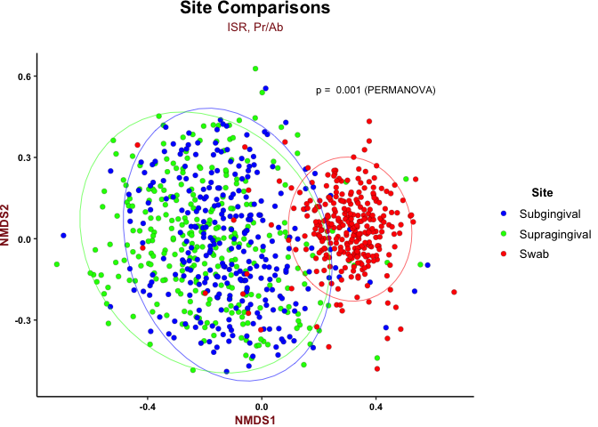

 

#### Combined Analysis

``` r
# For Combined Analysis
ISR_comb_counts <- ISR_seqtab_atab_comb_clean_filtp

# Assign "sample" id
ISR_comb_counts$sample <- row.names(ISR_comb_counts)

# Remove P1, P2 and S labels
ISR_comb_counts$sample <- gsub("_P1_ISR" , "", ISR_comb_counts$sample)
ISR_comb_counts$sample <- gsub("_P2_ISR" , "", ISR_comb_counts$sample)
ISR_comb_counts$sample <- gsub("_S_ISR" , "", ISR_comb_counts$sample)

# Split by sample
ISR_comb_counts_split <- split(ISR_comb_counts[, -ncol(ISR_comb_counts)], ISR_comb_counts$sample)
length(ISR_comb_counts_split) # 291
```

    ## [1] 291

``` r
# Remove samples where all 3 not present
rem_samples <- names(ISR_comb_counts_split)[which(sapply(ISR_comb_counts_split, nrow) != 3)]
rem_samples 
```

    ##  [1] "AD_104_M"  "AD_117_D"  "AD_117_M"  "AD_129_C2" "AD_153_C1"
    ##  [6] "AD_205_C2" "AD_206_M"  "AD_208_C2" "AD_213_C"  "AD_213_M" 
    ## [11] "AD_218_C"  "AD_236_C"  "AD_244_C"

``` r
# "AD_104_M"  "AD_117_D"  "AD_117_M"  "AD_129_C2" "AD_153_C1" "AD_205_C2" "AD_206_M"  "AD_208_C2" "AD_213_C"  "AD_213_M"  "AD_218_C"  "AD_236_C"  "AD_244_C" 

ISR_comb_counts_split_all3 <- ISR_comb_counts_split[!(names(ISR_comb_counts_split) %in% rem_samples)]
length(ISR_comb_counts_split_all3) # 278
```

    ## [1] 278

``` r
# Sum for 3 samples
ISR_comb_counts_split_sum <- ldply(lapply(ISR_comb_counts_split_all3, colSums))
row.names(ISR_comb_counts_split_sum) <- ISR_comb_counts_split_sum$.id
ISR_comb_counts_split_sum$.id <- NULL

# Remove empty columns
ISR_comb_counts_split_sum <- ISR_comb_counts_split_sum[,colSums(ISR_comb_counts_split_sum) > 0]
dim(ISR_comb_counts_split_sum) # 278 x 4213
```

    ## [1]  278 4213

 

Mother-Child Comparisons
------------------------

``` r
# For Mother-Child Comparisons
ISR_comb_counts_mch <- ISR_comb_counts_split_sum[row.names(ISR_comb_counts_split_sum) %in% ISR_comb_meta_mch$sample,]
ISR_comb_counts_mch <- ISR_comb_counts_mch[,colSums(ISR_comb_counts_mch) > 0]
dim(ISR_comb_counts_mch) # 194 x 3774
```

    ## [1]  194 3774

``` r
# Order rows to match counts
ISR_comb_meta_mch <- ISR_comb_meta_mch[order(as.character(ISR_comb_meta_mch$sample)),]

# sanity check
all(row.names(ISR_comb_counts_mch) == ISR_comb_meta_mch$sample) # TRUE
```

    ## [1] TRUE

``` r
# Subset meta for children only
ISR_comb_meta_mch_ch <- ISR_comb_meta_mch[ISR_comb_meta_mch$subject_type=="Biological Child" | ISR_comb_meta_mch$subject_type=="Adopted Child", ]

# Count how many samples
nrow(ISR_comb_meta_mch_ch[ISR_comb_meta_mch_ch$subject_type=="Biological Child",]) # 54
```

    ## [1] 54

``` r
nrow(ISR_comb_meta_mch_ch[ISR_comb_meta_mch_ch$subject_type=="Adopted Child",]) # 43
```

    ## [1] 43

 

#### Child Age Comparisons

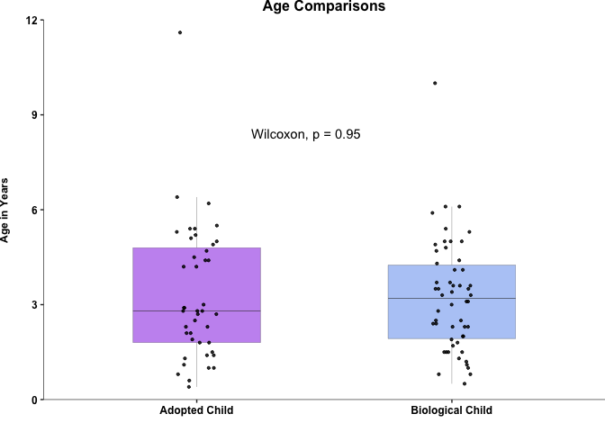

 

### Pr/Ab Analysis

``` r
# Rarefy counts
set.seed(12345); ISR_comb_counts_mch_rar <- as.data.frame(rrarefy(ISR_comb_counts_mch, min(rowSums(ISR_comb_counts_mch)))) # min(rowSums(ISR_comb_counts_mch)) = 25,923

# Convert Rarified counts to Pr/Ab:
ISR_comb_counts_mch_prab <- data.frame((ISR_comb_counts_mch_rar > 0)*1)

# Calculate distances
ISR_comb_counts_mch_prab_dm <- AD.melt.dist.sf(ISR_comb_counts_mch_prab, ISR_comb_meta_mch)$dm

# Add subject type info
ISR_comb_counts_mch_prab_dm$sub_type1 <- ISR_comb_meta_mch$subject_type[match(ISR_comb_counts_mch_prab_dm$Var1, ISR_comb_meta_mch$sample)]
ISR_comb_counts_mch_prab_dm$sub_type2 <- ISR_comb_meta_mch$subject_type[match(ISR_comb_counts_mch_prab_dm$Var2, ISR_comb_meta_mch$sample)]

# Combine sub_type to define relationship
ISR_comb_counts_mch_prab_dm$rel <- paste(ISR_comb_counts_mch_prab_dm$sub_type1, ISR_comb_counts_mch_prab_dm$sub_type2, sep="-")
ISR_comb_counts_mch_prab_dm$rel <- gsub("Biological ", "", ISR_comb_counts_mch_prab_dm$rel)
ISR_comb_counts_mch_prab_dm$rel <- gsub("Adopted ", "", ISR_comb_counts_mch_prab_dm$rel)
ISR_comb_counts_mch_prab_dm$grp <- paste(ISR_comb_counts_mch_prab_dm$family, ISR_comb_counts_mch_prab_dm$rel, sep=" ")
```

 

#### Logistic Renaming

``` r
# Renaming logically
ISR_comb_counts_mch_prab_dm[ISR_comb_counts_mch_prab_dm$grp == "Diff Family Child-Mother" | ISR_comb_counts_mch_prab_dm$grp == "Diff Family Mother-Child",]$grp <- "Child-Unrelated Mother"
ISR_comb_counts_mch_prab_dm[ISR_comb_counts_mch_prab_dm$grp == "Diff Family Child-Child",]$grp <- "Unrelated Child-Child"
ISR_comb_counts_mch_prab_dm[ISR_comb_counts_mch_prab_dm$grp == "Same Family Child-Mother" ,]$grp <- "Child-Mother"
ISR_comb_counts_mch_prab_dm[ISR_comb_counts_mch_prab_dm$grp == "Diff Family Mother-Mother" ,]$grp <- "Mother-Mother"

# Child-Mother & Child-Unrelated Mother
ISR_comb_counts_mch_prab_dm_chm <- ISR_comb_counts_mch_prab_dm[ISR_comb_counts_mch_prab_dm$grp == "Child-Mother" | ISR_comb_counts_mch_prab_dm$grp == "Child-Unrelated Mother",]

# Split into same and diff families
ISR_comb_counts_mch_prab_sfd <- ISR_comb_counts_mch_prab_dm_chm[ISR_comb_counts_mch_prab_dm_chm$grp == "Child-Mother",]
ISR_comb_counts_mch_prab_dfd <- ISR_comb_counts_mch_prab_dm_chm[ISR_comb_counts_mch_prab_dm_chm$grp == "Child-Unrelated Mother",]

# Generate random distances for unrelated
ISR_comb_counts_mch_prab_dfd_rd <- unrelated_dist1(ISR_comb_counts_mch_prab_dfd)$df

# Refine Group category
ISR_comb_counts_mch_prab_sfd$grp <- paste(sapply(strsplit(as.character(ISR_comb_counts_mch_prab_sfd$sub_type1), " "), '[', 1), ISR_comb_counts_mch_prab_sfd$grp)

# For combined plot
ISR_comb_counts_mch_prab_plot <- rbind.data.frame(ISR_comb_counts_mch_prab_sfd, ISR_comb_counts_mch_prab_dfd_rd)
```

 

#### Mother-Child Boxplot (Bray-Curtis)

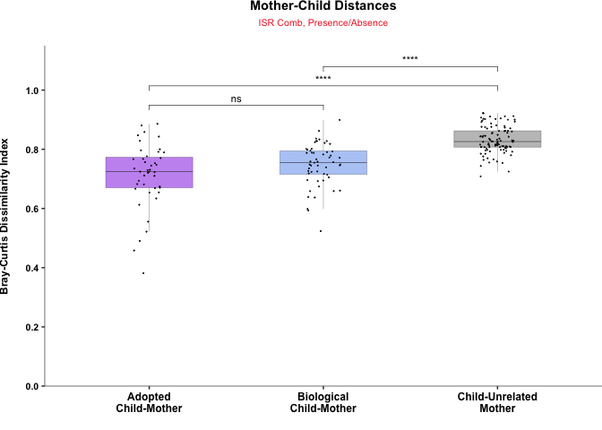

 

### Jaccard Distances

``` r
# Calculate distances
ISR_comb_counts_mch_prab_dmj <- AD.melt.dist.sf(ISR_comb_counts_mch_prab, ISR_comb_meta_mch)$dmj

# Add subject type info
ISR_comb_counts_mch_prab_dmj$sub_type1 <- ISR_comb_meta_mch$subject_type[match(ISR_comb_counts_mch_prab_dmj$Var1, ISR_comb_meta_mch$sample)]
ISR_comb_counts_mch_prab_dmj$sub_type2 <- ISR_comb_meta_mch$subject_type[match(ISR_comb_counts_mch_prab_dmj$Var2, ISR_comb_meta_mch$sample)]

# Combine sub_type to define relationship
ISR_comb_counts_mch_prab_dmj$rel <- paste(ISR_comb_counts_mch_prab_dmj$sub_type1, ISR_comb_counts_mch_prab_dmj$sub_type2, sep="-")
ISR_comb_counts_mch_prab_dmj$rel <- gsub("Biological ", "", ISR_comb_counts_mch_prab_dmj$rel)
ISR_comb_counts_mch_prab_dmj$rel <- gsub("Adopted ", "", ISR_comb_counts_mch_prab_dmj$rel)
ISR_comb_counts_mch_prab_dmj$grp <- paste(ISR_comb_counts_mch_prab_dmj$family, ISR_comb_counts_mch_prab_dmj$rel, sep=" ")
```

 

#### Logistic Renaming

``` r
# Renaming logically
ISR_comb_counts_mch_prab_dmj[ISR_comb_counts_mch_prab_dmj$grp == "Diff Family Child-Mother" | ISR_comb_counts_mch_prab_dmj$grp == "Diff Family Mother-Child",]$grp <- "Child-Unrelated Mother"
ISR_comb_counts_mch_prab_dmj[ISR_comb_counts_mch_prab_dmj$grp == "Diff Family Child-Child",]$grp <- "Unrelated Child-Child"
ISR_comb_counts_mch_prab_dmj[ISR_comb_counts_mch_prab_dmj$grp == "Same Family Child-Mother" ,]$grp <- "Child-Mother"
ISR_comb_counts_mch_prab_dmj[ISR_comb_counts_mch_prab_dmj$grp == "Diff Family Mother-Mother" ,]$grp <- "Mother-Mother"

# Child-Mother & Child-Unrelated Mother
ISR_comb_counts_mch_prab_dmj_chm <- ISR_comb_counts_mch_prab_dmj[ISR_comb_counts_mch_prab_dmj$grp == "Child-Mother" | ISR_comb_counts_mch_prab_dmj$grp == "Child-Unrelated Mother",]

# Split into same and diff families
ISR_comb_counts_mch_prab_sfd_j <- ISR_comb_counts_mch_prab_dmj_chm[ISR_comb_counts_mch_prab_dmj_chm$grp == "Child-Mother",]
ISR_comb_counts_mch_prab_dfd_j <- ISR_comb_counts_mch_prab_dmj_chm[ISR_comb_counts_mch_prab_dmj_chm$grp == "Child-Unrelated Mother",]

# Generate random distances for unrelated
ISR_comb_counts_mch_prab_dfd_j_rd <- unrelated_dist1(ISR_comb_counts_mch_prab_dfd_j)$df

# Refine Group category
ISR_comb_counts_mch_prab_sfd_j$grp <- paste(sapply(strsplit(as.character(ISR_comb_counts_mch_prab_sfd_j$sub_type1), " "), '[', 1), ISR_comb_counts_mch_prab_sfd_j$grp)

# For combined plot
ISR_comb_counts_mch_prab_plot_jc <- rbind.data.frame(ISR_comb_counts_mch_prab_sfd_j, ISR_comb_counts_mch_prab_dfd_j_rd)
```

 

#### Mother-Child Boxplot (Jaccard)


 

### Check variable (For potential confounders)

``` r
# Same Family Analysis 
# Add meta info
ISR_comb_counts_mch_prab_sfd$ch_age <- ISR_comb_meta_mch_ch$age[match(ISR_comb_counts_mch_prab_sfd$fam1, ISR_comb_meta_mch_ch$family_id)]
ISR_comb_counts_mch_prab_sfd$feed_mode <- ISR_comb_meta_mch_ch$feed_mode[match(ISR_comb_counts_mch_prab_sfd$fam1, ISR_comb_meta_mch_ch$family_id)]
ISR_comb_counts_mch_prab_sfd$del_mode <- ISR_comb_meta_mch_ch$del_mode[match(ISR_comb_counts_mch_prab_sfd$fam1, ISR_comb_meta_mch_ch$family_id)]

# Age 
# Remove 2 outlier ages
ISR_comb_counts_mch_prab_sfd_age <- ISR_comb_counts_mch_prab_sfd[ISR_comb_counts_mch_prab_sfd$ch_age < 10,]

# Test correlation of values with age
(ISR_comb_counts_mch_prab_sfd_agecor <- cor.test(ISR_comb_counts_mch_prab_sfd_age$ch_age, ISR_comb_counts_mch_prab_sfd_age$value, method = "spearman", exact = F))
signif(ISR_comb_counts_mch_prab_sfd_agecor$p.value, 2) # 4.2e-06
```

 

#### Plotting Mother-Child Distances vs. Child's Age

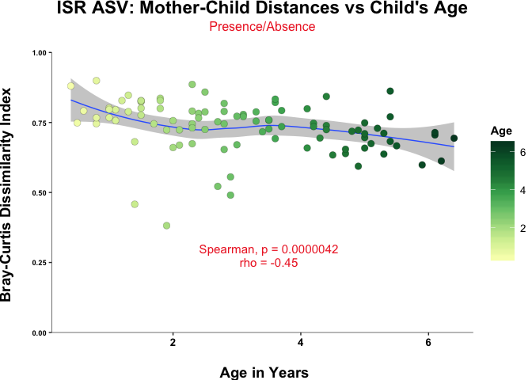

 

### Child's Age vs Mother-Child Distance: Unrelated

``` r
# Subset to make edits
ISR_comb_counts_mch_prab_dfd_age <- ISR_comb_counts_mch_prab_dfd_rd

# Extract child sample id
for (i in 1:nrow(ISR_comb_counts_mch_prab_dfd_age)){
  if (grepl("_C", ISR_comb_counts_mch_prab_dfd_age$Var1[i])){
    ISR_comb_counts_mch_prab_dfd_age$ch[i] <- as.character(ISR_comb_counts_mch_prab_dfd_age$Var1[i])
  }
  else {
    ISR_comb_counts_mch_prab_dfd_age$ch[i] <- as.character(ISR_comb_counts_mch_prab_dfd_age$Var2[i])
  }
}

# Add age info
ISR_comb_counts_mch_prab_dfd_age$ch_age <- ISR_comb_meta_mch_ch$age[match(ISR_comb_counts_mch_prab_dfd_age$ch, ISR_comb_meta_mch_ch$sample)]

# Remove 2 outlier ages
ISR_comb_counts_mch_prab_dfd_age <- ISR_comb_counts_mch_prab_dfd_age[ISR_comb_counts_mch_prab_dfd_age$ch_age < 10,]
nrow(ISR_comb_counts_mch_prab_dfd_age) # 189

# Test correlation of values with age
(ISR_comb_counts_mch_prab_dfd_agecor <- cor.test(ISR_comb_counts_mch_prab_dfd_age$ch_age, ISR_comb_counts_mch_prab_dfd_age$value, method = "spearman", exact = F))
signif(ISR_comb_counts_mch_prab_dfd_agecor$p.value, 2) # 4.2e-06
```

 

#### Plot

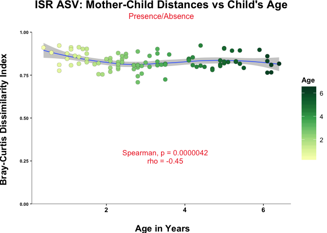

 

### Adult vs Child Ordination

``` r
# Compute NMDS
set.seed(12345); ISR_comb_counts_mch_prab.mds <- metaMDS(ISR_comb_counts_mch_prab, trymax = 200, autotransform = F, wascores = F)
```

``` r
# Making dataframe for plotting
ISR_comb_counts_mch_prab.mds.df <- data.frame(scores(ISR_comb_counts_mch_prab.mds, display = 'sites'))
ISR_comb_counts_mch_prab.mds.df$sub_type <- ISR_comb_meta_mch$subject_type[match(row.names(ISR_comb_counts_mch_prab.mds.df), ISR_comb_meta_mch$sample)]
ISR_comb_counts_mch_prab.mds.df$sub_type <- gsub("Biological ", "", ISR_comb_counts_mch_prab.mds.df$sub_type)
ISR_comb_counts_mch_prab.mds.df$sub_type <- gsub("Adopted ", "", ISR_comb_counts_mch_prab.mds.df$sub_type)
ISR_comb_counts_mch_prab.mds.df$sub_type <- gsub("Mother", "Adult", ISR_comb_counts_mch_prab.mds.df$sub_type)

# Permanova
set.seed(12345); (ISR_comb_counts_mch_prab.perm <- adonis(formula = ISR_comb_counts_mch_prab ~ ISR_comb_counts_mch_prab.mds.df$sub_type)) 
```

 

#### NMDS By Site

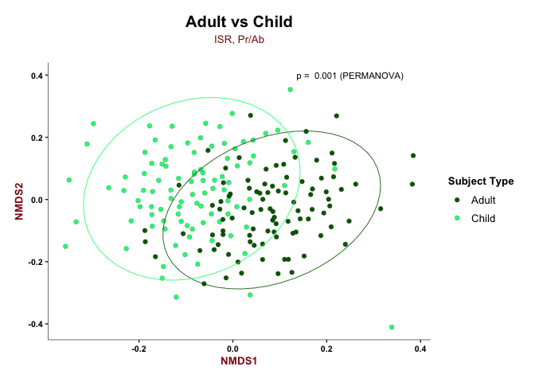

 

### ISR Adult vs Child: By Status

``` r
# Making dataframe for plotting
ISR_comb_counts_mch_prab.mds.df_status <- data.frame(scores(ISR_comb_counts_mch_prab.mds, display = 'sites'))
ISR_comb_counts_mch_prab.mds.df_status$sub_type <- ISR_comb_meta_mch$subject_type[match(row.names(ISR_comb_counts_mch_prab.mds.df_status), ISR_comb_meta_mch$sample)]
ISR_comb_counts_mch_prab.mds.df_status$status <- ISR_comb_meta_mch$status[match(row.names(ISR_comb_counts_mch_prab.mds.df_status), ISR_comb_meta_mch$sample)]
ISR_comb_counts_mch_prab.mds.df_status$subject_type <- ISR_comb_counts_mch_prab.mds.df_status$sub_type
ISR_comb_counts_mch_prab.mds.df_status$subject_type <- gsub("Adopted ","", ISR_comb_counts_mch_prab.mds.df_status$subject_type)
ISR_comb_counts_mch_prab.mds.df_status$subject_type <- gsub("Biological ","", ISR_comb_counts_mch_prab.mds.df_status$subject_type)
ISR_comb_counts_mch_prab.mds.df_status$sub_type <- gsub("Adopted Mother", "Adoptive Mother", ISR_comb_counts_mch_prab.mds.df_status$sub_type)
ISR_comb_counts_mch_prab.mds.df_status$family_id <- ISR_comb_meta_mch$family_id[match(row.names(ISR_comb_counts_mch_prab.mds.df_status), ISR_comb_meta_mch$sample)]

# Add centroids for ordispider (optional)
ISR_comb_counts_mch_cent <- aggregate(cbind(NMDS1, NMDS2) ~ family_id, data = ISR_comb_counts_mch_prab.mds.df_status, FUN = mean)

# Add info for line segments for ordispider
ISR_comb_counts_mch_segs <- merge(ISR_comb_counts_mch_prab.mds.df_status, setNames(ISR_comb_counts_mch_cent, c('family_id','oNMDS1','oNMDS2')),
              by = 'family_id', sort = FALSE)

# Permanova
set.seed(12345); (ISR_comb_counts_mch_prab_subtype.perm <- adonis(formula = ISR_comb_counts_mch_prab ~ ISR_comb_counts_mch_prab.mds.df_status$sub_type, 
                                                                  strata = ISR_comb_counts_mch_prab.mds.df_status$family_id))

# Permanova
set.seed(12345); (ISR_comb_counts_mch_prab_status.perm <- adonis(formula = ISR_comb_counts_mch_prab ~ ISR_comb_counts_mch_prab.mds.df_status$status, 
                                                                 strata = ISR_comb_counts_mch_prab.mds.df_status$family_id)) 
```

 

#### NMDS by Site, Centroids

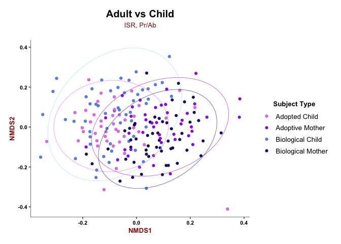

 

#### NMDS Spider Plot

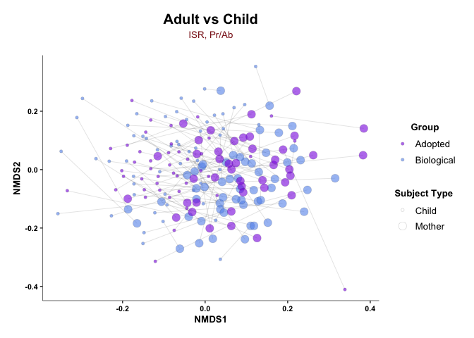

 

#### Example Plot

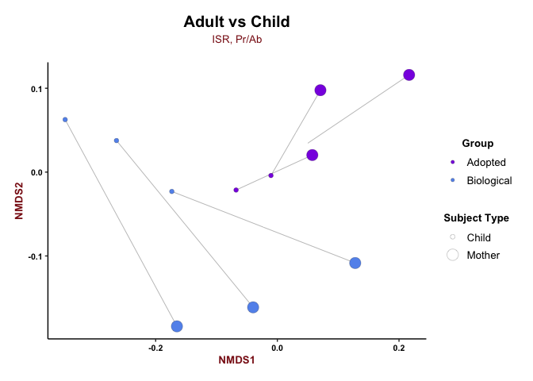

 

### Adoptive vs Bio Mothers

``` r
# Subset meta for mothers only
ISR_comb_meta_mch_mo <- ISR_comb_meta_mch[ISR_comb_meta_mch$subject_type=="Biological Mother" | ISR_comb_meta_mch$subject_type=="Adopted Mother", ]
ISR_comb_meta_mch_mo$subject_type <- gsub("Adopted Mother", "Adoptive Mothers", ISR_comb_meta_mch_mo$subject_type)
ISR_comb_meta_mch_mo$subject_type <- gsub("Biological Mother", "Biological Mothers", ISR_comb_meta_mch_mo$subject_type)

# Subset rarefied counts for Mother only
ISR_comb_counts_mch_prab_mo <- ISR_comb_counts_mch_prab[row.names(ISR_comb_counts_mch_prab) %in% ISR_comb_meta_mch_mo$sample,]
ISR_comb_counts_mch_prab_mo <- ISR_comb_counts_mch_prab_mo[,colSums(ISR_comb_counts_mch_prab_mo) > 0]
dim(ISR_comb_counts_mch_prab_mo) # 97 x 2753
```

    ## [1]   97 2753

``` r
# Renaming for convinience
ISR_comb_mo_comp <- ISR_comb_counts_mch_prab_mo
ISR_comb_meta_mo <- ISR_comb_meta_mch_mo

# Sanity Check
all(row.names(ISR_comb_mo_comp) == ISR_comb_meta_mo$sample) # TRUE
```

    ## [1] TRUE

 

#### Adopted vs Biological

``` r
# Compute NMDS
set.seed(12345); ISR_comb_mo_comp.mds <- metaMDS(ISR_comb_mo_comp, trymax = 500, autotransform = F, wascores = F)
```

``` r
# Making dataframe for plotting
ISR_comb_mo_comp.mds.df <- data.frame(scores(ISR_comb_mo_comp.mds, display = 'sites'))
ISR_comb_mo_comp.mds.df$status <- ISR_comb_meta_mch_mo$subject_type[match(row.names(ISR_comb_mo_comp.mds.df), ISR_comb_meta_mch_mo$sample)]

# Permanova
set.seed(12345); (ISR_comb_mo_comp.perm_status <- adonis(formula = ISR_comb_mo_comp ~ ISR_comb_meta_mch_mo$subject_type*ISR_comb_meta_mch_mo$age)) # Significant
```

&nbsp

#### NMDS by Site

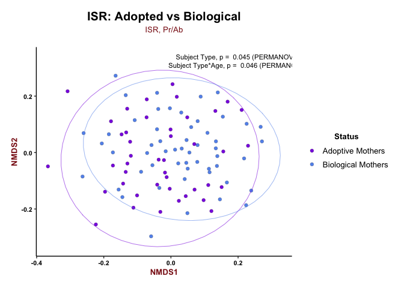

 

#### Mothers Age Comparisons

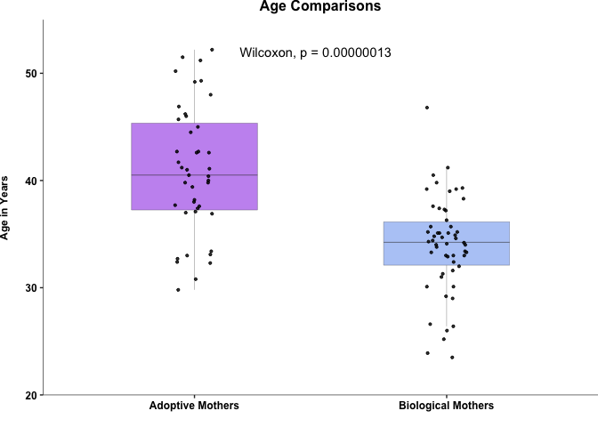

 

### Adopted vs Bio Child

``` r
# Subset rarefied counts for Children only
ISR_comb_counts_mch_prab_ch <- ISR_comb_counts_mch_prab[row.names(ISR_comb_counts_mch_prab) %in% ISR_comb_meta_mch_ch$sample,]
ISR_comb_counts_mch_prab_ch <- ISR_comb_counts_mch_prab_ch[,colSums(ISR_comb_counts_mch_prab_ch) > 0]
dim(ISR_comb_counts_mch_prab_ch) # 97 x 2667
```

    ## [1]   97 2667

``` r
# Remove unknown feed mode & delivery modes
ISR_comb_meta_mch_ch_f1 <- ISR_comb_meta_mch_ch[ISR_comb_meta_mch_ch$feed_mode != "Unknown" & ISR_comb_meta_mch_ch$del_mode != "Unknown", ]

# Rename for simplicity
ISR_comb_meta_ch <- ISR_comb_meta_mch_ch_f1

# Subset prabs
ISR_comb_counts_mch_prab_ch_f1 <- ISR_comb_counts_mch_prab_ch[row.names(ISR_comb_counts_mch_prab_ch) %in% ISR_comb_meta_ch$sample,]
ISR_comb_counts_mch_prab_ch_f1 <- ISR_comb_counts_mch_prab_ch_f1[,colSums(ISR_comb_counts_mch_prab_ch_f1) > 0]
dim(ISR_comb_counts_mch_prab_ch_f1) # 94 x 2632
```

    ## [1]   94 2632

``` r
ISR_comb_ch_comp <- ISR_comb_counts_mch_prab_ch_f1

dim(ISR_comb_ch_comp) # 94 2632 ( after removing unknwon feed and delivery modes)
```

    ## [1]   94 2632

``` r
dim(ISR_comb_meta_mch_ch_f1) # 94 10
```

    ## [1] 94 10

``` r
all(row.names(ISR_comb_ch_comp) == ISR_comb_meta_mch_ch_f1$sample) # TRUE
```

    ## [1] TRUE

 

#### Adopted vs Biological

``` r
# Compute NMDS
set.seed(12345); ISR_comb_ch_comp.mds <- metaMDS(ISR_comb_ch_comp, trymax = 500, autotransform = F, wascores = F)
```

``` r
# Making dataframe for plotting
ISR_comb_ch_comp.mds.df <- data.frame(scores(ISR_comb_ch_comp.mds, display = 'sites'))
ISR_comb_ch_comp.mds.df$status <- ISR_comb_meta_mch$status[match(row.names(ISR_comb_ch_comp.mds.df), ISR_comb_meta_mch$sample)]
ISR_comb_ch_comp.mds.df$feed_mode <- ISR_comb_meta_mch$feed_mode[match(row.names(ISR_comb_ch_comp.mds.df), ISR_comb_meta_mch$sample)]
ISR_comb_ch_comp.mds.df$ch_age <- ISR_comb_meta_mch_ch$age[match(row.names(ISR_comb_ch_comp.mds.df), ISR_comb_meta_mch_ch$sample)]
ISR_comb_ch_comp.mds.df$subject_type <- ISR_comb_meta_mch_ch$subject_type[match(row.names(ISR_comb_ch_comp.mds.df), ISR_comb_meta_mch_ch$sample)]

# Permanova
set.seed(12345); (ISR_comb_ch_comp.perm_status <- adonis(formula = ISR_comb_ch_comp ~ ISR_comb_ch_comp.mds.df$status)) # 0.001 ***
set.seed(12345); (ISR_comb_ch_comp.perm_feed <- adonis(formula = ISR_comb_ch_comp ~ ISR_comb_ch_comp.mds.df$feed_mode)) # 0.072
#set.seed(12345); (ISR_comb_ch_comp.perm_feed_cf <- adonis(formula = ISR_comb_ch_comp ~ ISR_comb_ch_comp.mds.df$feed_mode_cf)) # 0.164
```

 

#### NMDS By Status

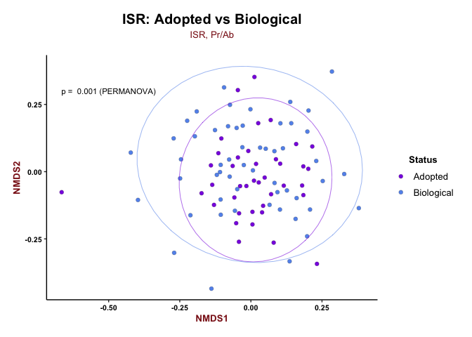

``` r
# Comparison by age
ISR_comb_ch_comp.mds.df_age <- ISR_comb_ch_comp.mds.df[ISR_comb_ch_comp.mds.df$ch_age < 10,]
```

 

#### Comparison by Age

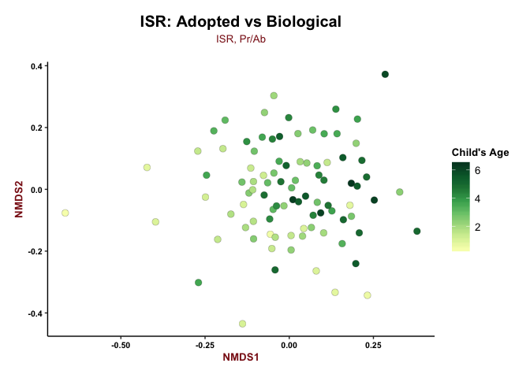

 

#### NMDS by Feed Mode

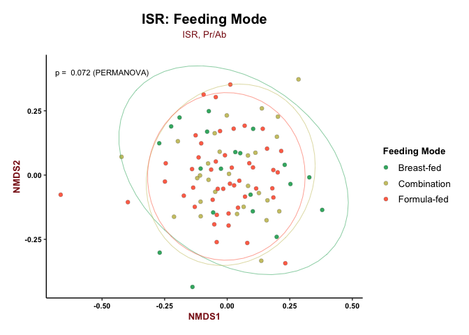

 

#### Feed Mode

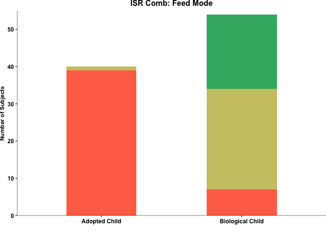

 

#### Theme Notes

    ## List of 9
    ##  $ axis.title     :List of 11
    ##   ..$ family       : NULL
    ##   ..$ face         : chr "bold"
    ##   ..$ colour       : chr "firebrick4"
    ##   ..$ size         : num 12
    ##   ..$ hjust        : NULL
    ##   ..$ vjust        : NULL
    ##   ..$ angle        : NULL
    ##   ..$ lineheight   : NULL
    ##   ..$ margin       : NULL
    ##   ..$ debug        : NULL
    ##   ..$ inherit.blank: logi FALSE
    ##   ..- attr(*, "class")= chr [1:2] "element_text" "element"
    ##  $ axis.text.x    :List of 11
    ##   ..$ family       : NULL
    ##   ..$ face         : chr "bold"
    ##   ..$ colour       : chr "black"
    ##   ..$ size         : num 12
    ##   ..$ hjust        : NULL
    ##   ..$ vjust        : NULL
    ##   ..$ angle        : NULL
    ##   ..$ lineheight   : NULL
    ##   ..$ margin       : NULL
    ##   ..$ debug        : NULL
    ##   ..$ inherit.blank: logi FALSE
    ##   ..- attr(*, "class")= chr [1:2] "element_text" "element"
    ##  $ axis.text.y    :List of 11
    ##   ..$ family       : NULL
    ##   ..$ face         : chr "bold"
    ##   ..$ colour       : chr "black"
    ##   ..$ size         : num 7
    ##   ..$ hjust        : NULL
    ##   ..$ vjust        : NULL
    ##   ..$ angle        : NULL
    ##   ..$ lineheight   : NULL
    ##   ..$ margin       : NULL
    ##   ..$ debug        : NULL
    ##   ..$ inherit.blank: logi FALSE
    ##   ..- attr(*, "class")= chr [1:2] "element_text" "element"
    ##  $ legend.key.size: 'unit' num 0.9cm
    ##   ..- attr(*, "valid.unit")= int 1
    ##   ..- attr(*, "unit")= chr "cm"
    ##  $ legend.text    :List of 11
    ##   ..$ family       : NULL
    ##   ..$ face         : NULL
    ##   ..$ colour       : NULL
    ##   ..$ size         : num 10
    ##   ..$ hjust        : NULL
    ##   ..$ vjust        : NULL
    ##   ..$ angle        : NULL
    ##   ..$ lineheight   : NULL
    ##   ..$ margin       : NULL
    ##   ..$ debug        : NULL
    ##   ..$ inherit.blank: logi FALSE
    ##   ..- attr(*, "class")= chr [1:2] "element_text" "element"
    ##  $ legend.title   :List of 11
    ##   ..$ family       : NULL
    ##   ..$ face         : chr "bold"
    ##   ..$ colour       : NULL
    ##   ..$ size         : num 12
    ##   ..$ hjust        : NULL
    ##   ..$ vjust        : NULL
    ##   ..$ angle        : NULL
    ##   ..$ lineheight   : NULL
    ##   ..$ margin       : NULL
    ##   ..$ debug        : NULL
    ##   ..$ inherit.blank: logi FALSE
    ##   ..- attr(*, "class")= chr [1:2] "element_text" "element"
    ##  $ plot.title     :List of 11
    ##   ..$ family       : NULL
    ##   ..$ face         : chr "bold"
    ##   ..$ colour       : NULL
    ##   ..$ size         : num 15
    ##   ..$ hjust        : num 0.5
    ##   ..$ vjust        : NULL
    ##   ..$ angle        : NULL
    ##   ..$ lineheight   : NULL
    ##   ..$ margin       : NULL
    ##   ..$ debug        : NULL
    ##   ..$ inherit.blank: logi FALSE
    ##   ..- attr(*, "class")= chr [1:2] "element_text" "element"
    ##  $ plot.subtitle  :List of 11
    ##   ..$ family       : NULL
    ##   ..$ face         : NULL
    ##   ..$ colour       : chr "firebrick4"
    ##   ..$ size         : num 8
    ##   ..$ hjust        : num 0.5
    ##   ..$ vjust        : NULL
    ##   ..$ angle        : NULL
    ##   ..$ lineheight   : NULL
    ##   ..$ margin       : NULL
    ##   ..$ debug        : NULL
    ##   ..$ inherit.blank: logi FALSE
    ##   ..- attr(*, "class")= chr [1:2] "element_text" "element"
    ##  $ plot.margin    : 'unit' num [1:4] 0.5cm 1cm 0.5cm 0.5cm
    ##   ..- attr(*, "valid.unit")= int 1
    ##   ..- attr(*, "unit")= chr "cm"
    ##  - attr(*, "class")= chr [1:2] "theme" "gg"
    ##  - attr(*, "complete")= logi FALSE
    ##  - attr(*, "validate")= logi TRUE

 

#### Subset Rarefied Counts for Children

``` r
# Subset rarefied counts for Children only
ISR_comb_counts_mch_prab_ch <- ISR_comb_counts_mch_prab[row.names(ISR_comb_counts_mch_prab) %in% ISR_comb_meta_mch_ch$sample,]
ISR_comb_counts_mch_prab_ch <- ISR_comb_counts_mch_prab_ch[,colSums(ISR_comb_counts_mch_prab_ch) > 0]
dim(ISR_comb_counts_mch_prab_ch) # 97 x 2667
```

    ## [1]   97 2667

``` r
# Remove unknown feed mode & delivery modes
ISR_comb_meta_mch_ch_f1 <- ISR_comb_meta_mch_ch[ISR_comb_meta_mch_ch$feed_mode != "Unknown" & ISR_comb_meta_mch_ch$del_mode != "Unknown", ]

# Rename for simplicity
ISR_comb_meta_ch <- ISR_comb_meta_mch_ch_f1

# Subset prabs
ISR_comb_counts_mch_prab_ch_f1 <- ISR_comb_counts_mch_prab_ch[row.names(ISR_comb_counts_mch_prab_ch) %in% ISR_comb_meta_ch$sample,]
ISR_comb_counts_mch_prab_ch_f1 <- ISR_comb_counts_mch_prab_ch_f1[,colSums(ISR_comb_counts_mch_prab_ch_f1) > 0]
dim(ISR_comb_counts_mch_prab_ch_f1) # 94 x 2632
```

    ## [1]   94 2632

 

#### Multivariate Analysis by PERMANOVA

``` r
# Confounding factors Analysis by Stepwise Constrained Ordination
ISR_comb_meta_ch_f1 <- ISR_comb_meta_ch[,c("age", "del_mode", "feed_mode", "gender", "status", "race")]

# Sanity check
all(ISR_comb_meta_ch$sample == row.names(ISR_comb_counts_mch_prab_ch_f1)) # TRUE

# Multivariate Analysis by PERMANOVA
set.seed(12345); (ISR_comb_counts_mch_prab_ch_f1.perm <- adonis(formula = ISR_comb_counts_mch_prab_ch_f1 ~ ISR_comb_meta_ch$status + ISR_comb_meta_ch$age + ISR_comb_meta_ch$feed_mode +ISR_comb_meta_ch$del_mode + ISR_comb_meta_ch$gender + ISR_comb_meta_ch$race))
# ISR_comb_meta_ch$status 0.001 ***
# ISR_comb_meta_ch$age 0.001 ***
# ISR_comb_meta_ch$feed_mode 0.016 * 

# Multivariate Analysis by PERMANOVA
set.seed(12345); (ISR_comb_counts_mch_prab_ch_f1.perm <- adonis(formula = ISR_comb_counts_mch_prab_ch_f1 ~ ISR_comb_meta_ch$feed_mode))
# No interactions among the 3 significant terms


# Checking feeding mmode
set.seed(99999); (test <- adonis(formula = ISR_comb_counts_mch_prab_ch_f1 ~ ISR_comb_meta_ch$feed_mode + ISR_comb_meta_ch$status + ISR_comb_meta_ch$age)) # 0.072
```

 

#### Capscale calculation (Constrained Analysis of Principal Coordinates)

``` r
ISR_comb_cs0 <- capscale(ISR_comb_counts_mch_prab_ch_f1 ~ 1, ISR_comb_meta_ch_f1, dist="bray") # Model with intercept only
ISR_comb_cs1 <- capscale(ISR_comb_counts_mch_prab_ch_f1 ~ ., ISR_comb_meta_ch_f1, dist="bray") # Model with all explanatory variables, i.e, the "scope"

# OrdiR2step
set.seed(12345); ISR_comb_cs.r2 <- ordiR2step(ISR_comb_cs0, ISR_comb_cs1, perm.max = 999)
ISR_comb_cs.r2$anova 
# Ordistep
set.seed(12345); ISR_comb_cs <- ordistep(ISR_comb_cs0, ISR_comb_cs1, perm.max = 999)
ISR_comb_cs$anova
```

 

### Family Distances Analysis

``` r
dim(ISR_comb_meta_3fam) # 66 x 11 (22 families of M, F, Ch)
```

    ## [1] 66 11

``` r
# 3 Fam Comparisons 
# a. M-ch vs F-ch, P-ch vs U-ch, Couples vs U-adults


# For Family Comparisons
ISR_comb_counts_3fam <- ISR_comb_counts_split_sum[row.names(ISR_comb_counts_split_sum) %in% ISR_comb_meta_3fam$sample,]
ISR_comb_counts_3fam <- ISR_comb_counts_3fam[,colSums(ISR_comb_counts_3fam) > 0]
dim(ISR_comb_counts_3fam) # 66 x 2140
```

    ## [1]   66 2140

``` r
# sanity check
all(row.names(ISR_comb_counts_3fam) == ISR_comb_meta_3fam$sample) # TRUE
```

    ## [1] TRUE

 

#### Pr/Ab Analysis

``` r
# Rarefy counts
set.seed(12345); ISR_comb_counts_3fam_rar <- as.data.frame(rrarefy(ISR_comb_counts_3fam, min(rowSums(ISR_comb_counts_3fam)))) # min(rowSums(ISR_comb_counts_3fam)) = 25,923

# Convert Rarified counts to Pr/Ab:
ISR_comb_counts_3fam_prab <- data.frame((ISR_comb_counts_3fam_rar > 0)*1)

# Calculate distances
ISR_comb_counts_3fam_prab_dm <- AD.melt.dist.sf(ISR_comb_counts_3fam_prab, ISR_comb_meta_3fam)$dm

# Add subject type info
ISR_comb_counts_3fam_prab_dm$sub_type1 <- ISR_comb_meta_3fam$subject_type[match(ISR_comb_counts_3fam_prab_dm$Var1, ISR_comb_meta_3fam$sample)]
ISR_comb_counts_3fam_prab_dm$sub_type2 <- ISR_comb_meta_3fam$subject_type[match(ISR_comb_counts_3fam_prab_dm$Var2, ISR_comb_meta_3fam$sample)]

# Remove "Biological "
ISR_comb_counts_3fam_prab_dm$sub_type1 <- gsub("Biological ", "", ISR_comb_counts_3fam_prab_dm$sub_type1)
ISR_comb_counts_3fam_prab_dm$sub_type2 <- gsub("Biological ", "", ISR_comb_counts_3fam_prab_dm$sub_type2)

# Combine sub_type to define relationship
ISR_comb_counts_3fam_prab_dm$rel <- paste(ISR_comb_counts_3fam_prab_dm$family, ISR_comb_counts_3fam_prab_dm$sub_type1, ISR_comb_counts_3fam_prab_dm$sub_type2)

# check all relationships
unique(ISR_comb_counts_3fam_prab_dm$rel)
```

    ##  [1] "Same Family Child Father"  "Same Family Child Mother" 
    ##  [3] "Same Family Father Mother" "Diff Family Child Child"  
    ##  [5] "Diff Family Father Child"  "Diff Family Mother Child" 
    ##  [7] "Diff Family Child Father"  "Diff Family Father Father"
    ##  [9] "Diff Family Mother Father" "Diff Family Child Mother" 
    ## [11] "Diff Family Father Mother" "Diff Family Mother Mother"

 

#### Logistic Renaming

``` r
# Renaming logically
ISR_comb_counts_3fam_prab_dm$rel[ISR_comb_counts_3fam_prab_dm$rel == "Same Family Child Father"] <- "Child-Father"
ISR_comb_counts_3fam_prab_dm$rel[ISR_comb_counts_3fam_prab_dm$rel == "Same Family Child Mother"] <- "Child-Mother"
ISR_comb_counts_3fam_prab_dm$rel[ISR_comb_counts_3fam_prab_dm$rel == "Same Family Father Mother"] <- "Couples"
ISR_comb_counts_3fam_prab_dm$rel[ISR_comb_counts_3fam_prab_dm$rel == "Diff Family Child Child"] <- "Unrelated Children"
ISR_comb_counts_3fam_prab_dm$rel[ISR_comb_counts_3fam_prab_dm$rel == "Diff Family Father Child" | ISR_comb_counts_3fam_prab_dm$rel == "Diff Family Child Father"] <- "Child-Unrelated Adult"
ISR_comb_counts_3fam_prab_dm$rel[ISR_comb_counts_3fam_prab_dm$rel == "Diff Family Mother Child" | ISR_comb_counts_3fam_prab_dm$rel == "Diff Family Child Mother"] <- "Child-Unrelated Adult"
ISR_comb_counts_3fam_prab_dm$rel[ISR_comb_counts_3fam_prab_dm$rel == "Diff Family Father Father" | ISR_comb_counts_3fam_prab_dm$rel == "Diff Family Mother Mother"] <- "Unrelated Adults"
ISR_comb_counts_3fam_prab_dm$rel[ISR_comb_counts_3fam_prab_dm$rel == "Diff Family Mother Father" | ISR_comb_counts_3fam_prab_dm$rel == "Diff Family Father Mother"] <- "Unrelated Adults"

# check new relationships
unique(ISR_comb_counts_3fam_prab_dm$rel)
```

    ## [1] "Child-Father"          "Child-Mother"          "Couples"              
    ## [4] "Unrelated Children"    "Child-Unrelated Adult" "Unrelated Adults"

 

#### Subset for Comparison

``` r
# Subset for Same Family Comparisons
ISR_comb_counts_3fam_sf <- ISR_comb_counts_3fam_prab_dm[ISR_comb_counts_3fam_prab_dm$family == "Same Family",]

# Subset distances for random sampling
ISR_comb_ch_unrelads <- ISR_comb_counts_3fam_prab_dm[ISR_comb_counts_3fam_prab_dm$rel=="Child-Unrelated Adult",]
ISR_comb_unrelads <- ISR_comb_counts_3fam_prab_dm[ISR_comb_counts_3fam_prab_dm$rel=="Unrelated Adults",]
ISR_comb_unrelch <- ISR_comb_counts_3fam_prab_dm[ISR_comb_counts_3fam_prab_dm$rel=="Unrelated Children",]

# Generate random distances for unrelated
ISR_comb_ch_unrelads_rd <- unrelated_dist1(ISR_comb_ch_unrelads)$df
ISR_comb_unrelads_rd <- unrelated_dist1(ISR_comb_unrelads)$df
ISR_comb_unrelch_rd <- unrelated_dist1(ISR_comb_unrelch)$df

# Make new df for plotting
ISR_comb_3fam_plot <- rbind.data.frame(ISR_comb_counts_3fam_sf, ISR_comb_ch_unrelads_rd, ISR_comb_unrelads_rd, ISR_comb_unrelch_rd)
```

 

#### Subset Counts

``` r
# Subset Counts
ISR_comb_counts_sibs <- ISR_comb_counts_split_sum[row.names(ISR_comb_counts_split_sum) %in% ISR_comb_meta_sibs$sample,]
ISR_comb_counts_sibs <- ISR_comb_counts_sibs[,colSums(ISR_comb_counts_sibs) > 0]
dim(ISR_comb_counts_sibs) # 34 x 1355
```

    ## [1]   34 1355

``` r
# sanity check
all(row.names(ISR_comb_counts_sibs) == ISR_comb_meta_sibs$sample) # TRUE
```

    ## [1] TRUE

 

#### Pr/Ab Analysis

``` r
# Rarefy counts
set.seed(12345); ISR_comb_counts_sibs_rar <- as.data.frame(rrarefy(ISR_comb_counts_sibs, min(rowSums(ISR_comb_counts_sibs))))

# Convert Rarified counts to Pr/Ab:
ISR_comb_counts_sibs_prab <- data.frame((ISR_comb_counts_sibs_rar > 0)*1)

# Calculate distances
ISR_comb_counts_sibs_prab_dm <- AD.melt.dist.sf(ISR_comb_counts_sibs_prab, ISR_comb_meta_sibs)$dm
#View(ISR_comb_counts_sibs_prab_dm)

ISR_comb_counts_sibs_prab_dm$rel <- "Siblings"
ISR_comb_counts_sibs_prab_dm$rel[ISR_comb_counts_sibs_prab_dm$family == "Diff Family"] <- "Non-Siblings"
```

 

#### Subset for sf/df

``` r
# Subset for sf/df
ISR_comb_sibs_only <- ISR_comb_counts_sibs_prab_dm[ISR_comb_counts_sibs_prab_dm$rel=="Siblings",]
ISR_comb_nonsibs_only <- ISR_comb_counts_sibs_prab_dm[ISR_comb_counts_sibs_prab_dm$rel=="Non-Siblings",]

# Generate random distances for unrelated
ISR_comb_nonsibs_only_rd <- unrelated_dist1(ISR_comb_nonsibs_only)$df

# Make new df for plotting
ISR_comb_sibs_plot <- rbind.data.frame(ISR_comb_sibs_only, ISR_comb_nonsibs_only_rd)

# Re-order
ISR_comb_sibs_plot$rel <- factor(ISR_comb_sibs_plot$rel, levels=c("Siblings", "Non-Siblings"))
```

 

#### Subset for Child-Parent

``` r
# For Child-Parent
ISR_comb_3fam_plot_cp <- ISR_comb_3fam_plot[ISR_comb_3fam_plot$rel=="Child-Father" | ISR_comb_3fam_plot$rel=="Child-Mother", ]
ISR_comb_3fam_plot_cp$rel <- "Child-Parent"

# Combining 3fam, cp and siblings
ISR_all_fam_dists <- rbind.data.frame(ISR_comb_3fam_plot[,-c(7,8)], ISR_comb_3fam_plot_cp[,-c(7,8)], ISR_comb_sibs_plot)
#View(ISR_all_fam_dists)

ISR_all_fam_dists$rel <- gsub("Non-Siblings", "Unrelated Children", ISR_all_fam_dists$rel)
unique(ISR_all_fam_dists$rel)
```

    ## [1] "Child-Father"          "Child-Mother"          "Couples"              
    ## [4] "Child-Unrelated Adult" "Unrelated Adults"      "Unrelated Children"   
    ## [7] "Child-Parent"          "Siblings"

``` r
# "Child-Father"          "Child-Mother"          "Couples"               "Child-Unrelated Adult" "Unrelated Adults"      "Unrelated Children"    "Child-Parent"          "Siblings"

ISR_all_fam_dists$rel <- factor(ISR_all_fam_dists$rel, levels=levels(reorder(ISR_all_fam_dists$rel, ISR_all_fam_dists$value, median)))
ISR_all_fam_dists_cols <- c("yellow", "firebrick2", "slateblue", "chartreuse4", "hotpink", "antiquewhite4", "thistle4", "grey50")
```

 

#### Distance Only, Violin & Box

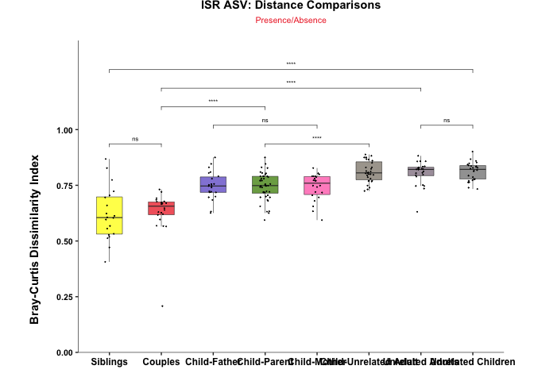

 

Individual Analysis of Supragingival, Subgingival, and Saliva
-------------------------------------------------------------

### Supragingival Analysis

``` r
# Split by P1, P2 and S for individual analysis
dim(ISR_seqtab_atab_comb_clean_filtp) # 857 x 4244
```

    ## [1]  857 4224

``` r
# For P1 samples
ISR_sup <- ISR_seqtab_atab_comb_clean_filtp[grepl("P1", row.names(ISR_seqtab_atab_comb_clean_filtp)),]
ISR_sup <- ISR_sup[,colSums(ISR_sup) > 0]
dim(ISR_sup) # 287 x 2981
```

    ## [1]  287 2981

``` r
# Remove _P1 for matching with Meta
row.names(ISR_sup) <- gsub("_P1_ISR" , "", row.names(ISR_sup))

# For Mother-Child Comparisons
ISR_sup_mch <- ISR_sup[row.names(ISR_sup) %in% ISR_comb_meta_mch$sample,]
ISR_sup_mch <- ISR_sup_mch[,colSums(ISR_sup_mch) > 0]
dim(ISR_sup_mch) # 194 x 2359
```

    ## [1]  194 2359

``` r
# sanity check
all(row.names(ISR_sup_mch) == ISR_comb_meta_mch$sample)
```

    ## [1] TRUE

 

#### Pr/Ab Analysis

``` r
# Rarefy counts
set.seed(12345); ISR_sup_mch_rar <- as.data.frame(rrarefy(ISR_sup_mch, min(rowSums(ISR_sup_mch))))

# Convert Rarified counts to Pr/Ab:
ISR_sup_mch_prab <- data.frame((ISR_sup_mch_rar > 0)*1)

# Calculate distances
ISR_sup_mch_prab_dm <- AD.melt.dist.sf(ISR_sup_mch_prab, ISR_comb_meta_mch)$dm

# Add subject type info
ISR_sup_mch_prab_dm$sub_type1 <- ISR_comb_meta_mch$subject_type[match(ISR_sup_mch_prab_dm$Var1, ISR_comb_meta_mch$sample)]
ISR_sup_mch_prab_dm$sub_type2 <- ISR_comb_meta_mch$subject_type[match(ISR_sup_mch_prab_dm$Var2, ISR_comb_meta_mch$sample)]

# Combine sub_type to define relationship
ISR_sup_mch_prab_dm$rel <- paste(ISR_sup_mch_prab_dm$sub_type1, ISR_sup_mch_prab_dm$sub_type2, sep="-")
ISR_sup_mch_prab_dm$rel <- gsub("Biological ", "", ISR_sup_mch_prab_dm$rel)
ISR_sup_mch_prab_dm$rel <- gsub("Adopted ", "", ISR_sup_mch_prab_dm$rel)
ISR_sup_mch_prab_dm$grp <- paste(ISR_sup_mch_prab_dm$family, ISR_sup_mch_prab_dm$rel, sep=" ")
```

 

#### Logistic Renaming

``` r
# Renaming logically
ISR_sup_mch_prab_dm[ISR_sup_mch_prab_dm$grp == "Diff Family Child-Mother" | ISR_sup_mch_prab_dm$grp == "Diff Family Mother-Child",]$grp <- "Child-Unrelated Mother"
ISR_sup_mch_prab_dm[ISR_sup_mch_prab_dm$grp == "Diff Family Child-Child",]$grp <- "Unrelated Child-Child"
ISR_sup_mch_prab_dm[ISR_sup_mch_prab_dm$grp == "Same Family Child-Mother" ,]$grp <- "Child-Mother"
ISR_sup_mch_prab_dm[ISR_sup_mch_prab_dm$grp == "Diff Family Mother-Mother" ,]$grp <- "Mother-Mother"

# Child-Mother & Child-Unrelated Mother
ISR_sup_mch_prab_dm_chm <- ISR_sup_mch_prab_dm[ISR_sup_mch_prab_dm$grp == "Child-Mother" | ISR_sup_mch_prab_dm$grp == "Child-Unrelated Mother",]
```

#### Split by Families

``` r
# Split into same and diff families
ISR_sup_mch_prab_sfd <- ISR_sup_mch_prab_dm_chm[ISR_sup_mch_prab_dm_chm$grp == "Child-Mother",]
ISR_sup_mch_prab_dfd <- ISR_sup_mch_prab_dm_chm[ISR_sup_mch_prab_dm_chm$grp == "Child-Unrelated Mother",]

# Generate random distances for unrelated
ISR_sup_mch_prab_dfd_rd <- unrelated_dist1(ISR_sup_mch_prab_dfd)$df

range(ISR_sup_mch_prab_dfd_rd$value) # 0.7755102 1.0000000
```

    ## [1] 0.7560976 1.0000000

``` r
# Refine Group category
ISR_sup_mch_prab_sfd$grp <- paste(sapply(strsplit(as.character(ISR_sup_mch_prab_sfd$sub_type1), " "), '[', 1), ISR_sup_mch_prab_sfd$grp)

# For combined plot
ISR_sup_mch_prab_plot <- rbind.data.frame(ISR_sup_mch_prab_sfd, ISR_sup_mch_prab_dfd_rd)
```

 

#### Mother-Child Boxplot

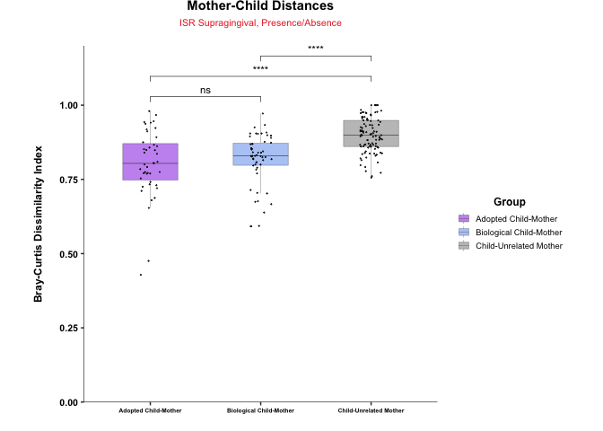

 

### Subgingival Analysis

``` r
# For P2 samples
ISR_sub <- ISR_seqtab_atab_comb_clean_filtp[grepl("P2", row.names(ISR_seqtab_atab_comb_clean_filtp)),]
ISR_sub <- ISR_sub[,colSums(ISR_sub) > 0]
dim(ISR_sub) # 281 x 3458
```

    ## [1]  281 3451

``` r
# Remove _P2 for matching with Meta
row.names(ISR_sub) <- gsub("_P2_ISR" , "", row.names(ISR_sub))

# For Mother-Child Comparisons
ISR_sub_mch <- ISR_sub[row.names(ISR_sub) %in% ISR_comb_meta_mch$sample,]
ISR_sub_mch <- ISR_sub_mch[,colSums(ISR_sub_mch) > 0]
dim(ISR_sub_mch) # 194 x 2865
```

    ## [1]  194 2865

``` r
# Re-order
ISR_sub_mch <- ISR_sub_mch[order(as.character(row.names(ISR_sub_mch))),]

# sanity check
all(row.names(ISR_sub_mch) == ISR_comb_meta_mch$sample)
```

    ## [1] TRUE

 

#### Pr/Ab Analysis

``` r
# Rarefy counts
set.seed(12345); ISR_sub_mch_rar <- as.data.frame(rrarefy(ISR_sub_mch, min(rowSums(ISR_sub_mch))))

# Convert Rarified counts to Pr/Ab:
ISR_sub_mch_prab <- data.frame((ISR_sub_mch_rar > 0)*1)

# Calculate distances
ISR_sub_mch_prab_dm <- AD.melt.dist.sf(ISR_sub_mch_prab, ISR_comb_meta_mch)$dm

# Add subject type info
ISR_sub_mch_prab_dm$sub_type1 <- ISR_comb_meta_mch$subject_type[match(ISR_sub_mch_prab_dm$Var1, ISR_comb_meta_mch$sample)]
ISR_sub_mch_prab_dm$sub_type2 <- ISR_comb_meta_mch$subject_type[match(ISR_sub_mch_prab_dm$Var2, ISR_comb_meta_mch$sample)]

# Combine sub_type to define relationship
ISR_sub_mch_prab_dm$rel <- paste(ISR_sub_mch_prab_dm$sub_type1, ISR_sub_mch_prab_dm$sub_type2, sep="-")
ISR_sub_mch_prab_dm$rel <- gsub("Biological ", "", ISR_sub_mch_prab_dm$rel)
ISR_sub_mch_prab_dm$rel <- gsub("Adopted ", "", ISR_sub_mch_prab_dm$rel)
ISR_sub_mch_prab_dm$grp <- paste(ISR_sub_mch_prab_dm$family, ISR_sub_mch_prab_dm$rel, sep=" ")
```

 

#### Logistic Renaming

``` r
# Renaming logically
ISR_sub_mch_prab_dm[ISR_sub_mch_prab_dm$grp == "Diff Family Child-Mother" | ISR_sub_mch_prab_dm$grp == "Diff Family Mother-Child",]$grp <- "Child-Unrelated Mother"
ISR_sub_mch_prab_dm[ISR_sub_mch_prab_dm$grp == "Diff Family Child-Child",]$grp <- "Unrelated Child-Child"
ISR_sub_mch_prab_dm[ISR_sub_mch_prab_dm$grp == "Same Family Child-Mother" ,]$grp <- "Child-Mother"
ISR_sub_mch_prab_dm[ISR_sub_mch_prab_dm$grp == "Diff Family Mother-Mother" ,]$grp <- "Mother-Mother"

# Child-Mother & Child-Unrelated Mother
ISR_sub_mch_prab_dm_chm <- ISR_sub_mch_prab_dm[ISR_sub_mch_prab_dm$grp == "Child-Mother" | ISR_sub_mch_prab_dm$grp == "Child-Unrelated Mother",]

# Split into same and diff families
ISR_sub_mch_prab_sfd <- ISR_sub_mch_prab_dm_chm[ISR_sub_mch_prab_dm_chm$grp == "Child-Mother",]
ISR_sub_mch_prab_dfd <- ISR_sub_mch_prab_dm_chm[ISR_sub_mch_prab_dm_chm$grp == "Child-Unrelated Mother",]

# Generate random distances for unrelated
ISR_sub_mch_prab_dfd_rd <- unrelated_dist1(ISR_sub_mch_prab_dfd)$df

range(ISR_sub_mch_prab_dfd_rd$value) # 0.7636364 1.0000000
```

    ## [1] 0.7319588 0.9838710

``` r
# Refine Group category
ISR_sub_mch_prab_sfd$grp <- paste(sapply(strsplit(as.character(ISR_sub_mch_prab_sfd$sub_type1), " "), '[', 1), ISR_sub_mch_prab_sfd$grp)

# For combined plot
ISR_sub_mch_prab_plot <- rbind.data.frame(ISR_sub_mch_prab_sfd, ISR_sub_mch_prab_dfd_rd)
```

 

#### Mother-Child Boxplot

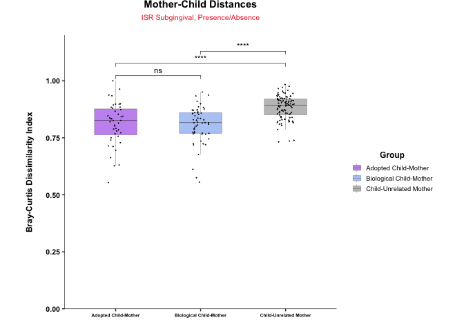

 

### Saliva Analysis

``` r
# For S samples
ISR_sal <- ISR_seqtab_atab_comb_clean_filtp[grepl("_S", row.names(ISR_seqtab_atab_comb_clean_filtp)),]
ISR_sal <- ISR_sal[,colSums(ISR_sal) > 0]
dim(ISR_sal) # 289 x 2150
```

    ## [1]  289 2150

``` r
# Remove _S for matching with Meta
row.names(ISR_sal) <- gsub("_S_ISR" , "", row.names(ISR_sal))

# For Mother-Child Comparisons
ISR_sal_mch <- ISR_sal[row.names(ISR_sal) %in% ISR_comb_meta_mch$sample,]
ISR_sal_mch <- ISR_sal_mch[,colSums(ISR_sal_mch) > 0]
dim(ISR_sal_mch) # 194 x 1848
```

    ## [1]  194 1848

``` r
# Re-order
ISR_sal_mch <- ISR_sal_mch[order(as.character(row.names(ISR_sal_mch))),]

# sanity check
all(row.names(ISR_sal_mch) == ISR_comb_meta_mch$sample)
```

    ## [1] TRUE

 

#### Pr/Ab Analysis

``` r
# Rarefy counts
set.seed(12345); ISR_sal_mch_rar <- as.data.frame(rrarefy(ISR_sal_mch, min(rowSums(ISR_sal_mch)))) # min(rowSums(ISR_sal_mch)) = 3942

# Convert Rarified counts to Pr/Ab:
ISR_sal_mch_prab <- data.frame((ISR_sal_mch_rar > 0)*1)

# Calculate distances
ISR_sal_mch_prab_dm <- AD.melt.dist.sf(ISR_sal_mch_prab, ISR_comb_meta_mch)$dm

# Add subject type info
ISR_sal_mch_prab_dm$sub_type1 <- ISR_comb_meta_mch$subject_type[match(ISR_sal_mch_prab_dm$Var1, ISR_comb_meta_mch$sample)]
ISR_sal_mch_prab_dm$sub_type2 <- ISR_comb_meta_mch$subject_type[match(ISR_sal_mch_prab_dm$Var2, ISR_comb_meta_mch$sample)]

# Combine sub_type to define relationship
ISR_sal_mch_prab_dm$rel <- paste(ISR_sal_mch_prab_dm$sub_type1, ISR_sal_mch_prab_dm$sub_type2, sep="-")
ISR_sal_mch_prab_dm$rel <- gsub("Biological ", "", ISR_sal_mch_prab_dm$rel)
ISR_sal_mch_prab_dm$rel <- gsub("Adopted ", "", ISR_sal_mch_prab_dm$rel)
ISR_sal_mch_prab_dm$grp <- paste(ISR_sal_mch_prab_dm$family, ISR_sal_mch_prab_dm$rel, sep=" ")
```

 

#### Logistic Renaming

``` r
# Renaming logically
ISR_sal_mch_prab_dm[ISR_sal_mch_prab_dm$grp == "Diff Family Child-Mother" | ISR_sal_mch_prab_dm$grp == "Diff Family Mother-Child",]$grp <- "Child-Unrelated Mother"
ISR_sal_mch_prab_dm[ISR_sal_mch_prab_dm$grp == "Diff Family Child-Child",]$grp <- "Unrelated Child-Child"
ISR_sal_mch_prab_dm[ISR_sal_mch_prab_dm$grp == "Same Family Child-Mother" ,]$grp <- "Child-Mother"
ISR_sal_mch_prab_dm[ISR_sal_mch_prab_dm$grp == "Diff Family Mother-Mother" ,]$grp <- "Mother-Mother"

# Child-Mother & Child-Unrelated Mother
ISR_sal_mch_prab_dm_chm <- ISR_sal_mch_prab_dm[ISR_sal_mch_prab_dm$grp == "Child-Mother" | ISR_sal_mch_prab_dm$grp == "Child-Unrelated Mother",]

# Split into same and diff families
ISR_sal_mch_prab_sfd <- ISR_sal_mch_prab_dm_chm[ISR_sal_mch_prab_dm_chm$grp == "Child-Mother",]
ISR_sal_mch_prab_dfd <- ISR_sal_mch_prab_dm_chm[ISR_sal_mch_prab_dm_chm$grp == "Child-Unrelated Mother",]

# Generate random distances for unrelated
ISR_sal_mch_prab_dfd_rd <- unrelated_dist1(ISR_sal_mch_prab_dfd)$df

range(ISR_sal_mch_prab_dfd_rd$value) # 0.5604396 0.9842520
```

    ## [1] 0.5909091 1.0000000

``` r
# Refine Group category
ISR_sal_mch_prab_sfd$grp <- paste(sapply(strsplit(as.character(ISR_sal_mch_prab_sfd$sub_type1), " "), '[', 1), ISR_sal_mch_prab_sfd$grp)

# For combined plot
ISR_sal_mch_prab_plot <- rbind.data.frame(ISR_sal_mch_prab_sfd, ISR_sal_mch_prab_dfd_rd)
```

 

#### Mother-Child Boxplot

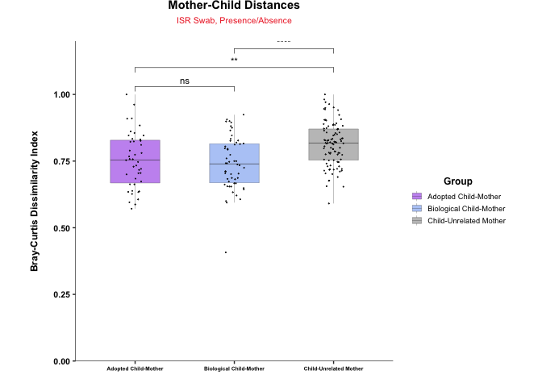

 

### Saliva Age Mother Child Distance

``` r
ISR_sal_mch_prab_sfd_age <- ISR_sal_mch_prab_sfd
ISR_sal_mch_prab_sfd_age$ch_age <- ISR_comb_meta_mch$age[match(ISR_sal_mch_prab_sfd_age$Var1, ISR_comb_meta_mch$sample)]

# Remove 2 outlier ages
ISR_sal_mch_prab_sfd_age <- ISR_sal_mch_prab_sfd_age[ISR_sal_mch_prab_sfd_age$ch_age < 10, ]


# Test correlation of values with age
(ISR_sal_mch_prab_sfd_agecor <- cor.test(ISR_sal_mch_prab_sfd_age$ch_age, ISR_sal_mch_prab_sfd_age$value, method = "spearman", exact = F))
signif(ISR_sal_mch_prab_sfd_agecor$p.value, 2) # 4.2e-06
```

 

#### Visualize Saliva Mother-Child Distances

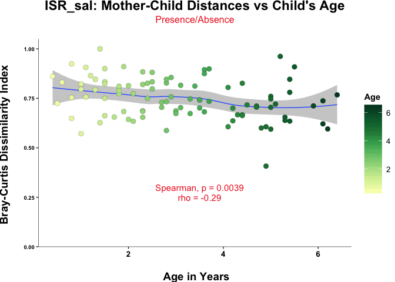

 

#### For Child only comparisons

``` r
ISR_sal_mch_ch <- ISR_sal[row.names(ISR_sal) %in% ISR_comb_meta_mch_ch$sample,]
ISR_sal_mch_ch <- ISR_sal_mch_ch[,colSums(ISR_sal_mch_ch) > 0]
dim(ISR_sal_mch_ch) # 97 1185
```

    ## [1]   97 1185

 

### Alpha Diversity Analysis

 

#### Shannon Calculation

``` r
# Rarefy counts
set.seed(12345); ISR_sal_mch_ch_rar <- as.data.frame(rrarefy(ISR_sal_mch_ch, min(rowSums(ISR_sal_mch_ch))))

# Calculate Shannon by 100 trials
set.seed(12345); ISR_sal_mch_ch_shannon <- rep(0,nrow(ISR_sal_mch_ch_rar));trials=100
for(i in 1:trials) { 
  ISR_sal_mch_ch_shannon <- ISR_sal_mch_ch_shannon + diversity(ISR_sal_mch_ch_rar)}

# Mean Shannon
ISR_sal_mch_ch_shannon.mean <- ISR_sal_mch_ch_shannon/trials
```

 

#### Simpson Calculation

``` r
# Calculate Simpson by 100 trials
set.seed(12345); ISR_sal_mch_ch_simpson <- rep(0,nrow(ISR_sal_mch_ch_rar));trials=100
for(i in 1:trials) { 
  ISR_sal_mch_ch_simpson <- ISR_sal_mch_ch_simpson + diversity(ISR_sal_mch_ch_rar, index = "simpson")}

# Mean Simpson
ISR_sal_mch_ch_simpson.mean <- ISR_sal_mch_ch_simpson/trials

# Make data frame for plotting
ISR_sal_mch_ch_alpha.df <- data.frame(ISR_sal_mch_ch_shannon.mean, ISR_sal_mch_ch_simpson.mean)
colnames(ISR_sal_mch_ch_alpha.df) <- c("Shannon", "Simpson")
ISR_sal_mch_ch_alpha.df$status <- ISR_comb_meta_mch_ch$status[match(row.names(ISR_sal_mch_ch_alpha.df), ISR_comb_meta_mch_ch$sample)]
ISR_sal_mch_ch_alpha.df$status <- paste0(ISR_sal_mch_ch_alpha.df$status, " Children")
ISR_sal_mch_ch_alpha.df$age <- ISR_comb_meta_mch_ch$age[match(row.names(ISR_sal_mch_ch_alpha.df), ISR_comb_meta_mch_ch$sample)]
ISR_sal_mch_ch_alpha.df$feed_mode <- ISR_comb_meta_mch_ch$feed_mode[match(row.names(ISR_sal_mch_ch_alpha.df), ISR_comb_meta_mch_ch$sample)]
```

 

#### Shannon, Age

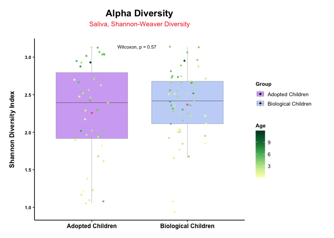

 

#### Simpson, Age

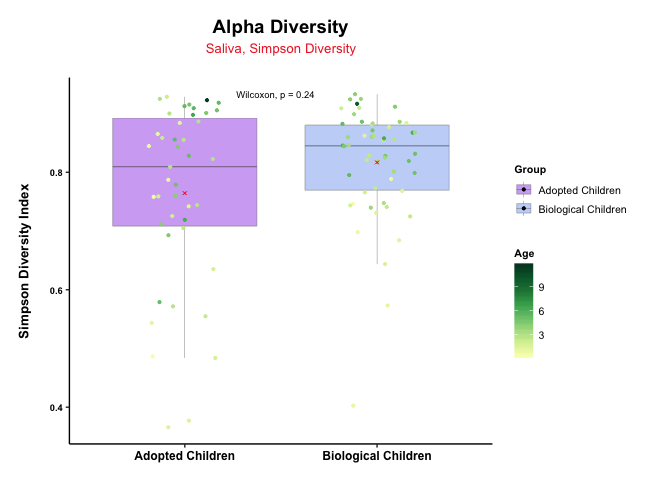

 

### March 13th

``` r
# Feed mode for sup
# Subset Sup counts for children's comparisons
ISR_sup_mch_prab_ch_comp <- ISR_sup_mch_prab[row.names(ISR_sup_mch_prab) %in% row.names(ISR_comb_ch_comp),]
ISR_sup_mch_prab_ch_comp <- ISR_sup_mch_prab_ch_comp[,colSums(ISR_sup_mch_prab_ch_comp) > 0]
dim(ISR_sup_mch_prab_ch_comp) # 94 x 1479
```

    ## [1]   94 1479

``` r
all(row.names(ISR_sup_mch_prab_ch_comp) == ISR_comb_meta_ch$sample) # TRUE
```

    ## [1] TRUE

 

### Adopted vs. Biological

``` r
# Compute NMDS
set.seed(12345); ISR_sup_mch_prab_ch_comp.mds <- metaMDS(ISR_sup_mch_prab_ch_comp, trymax = 500, autotransform = F, wascores = F)
```

``` r
# Making dataframe for plotting
ISR_sup_mch_prab_ch_comp.mds.df <- data.frame(scores(ISR_sup_mch_prab_ch_comp.mds, display = 'sites'))
ISR_sup_mch_prab_ch_comp.mds.df$status <- ISR_comb_meta_mch$status[match(row.names(ISR_sup_mch_prab_ch_comp.mds.df), ISR_comb_meta_mch$sample)]
ISR_sup_mch_prab_ch_comp.mds.df$feed_mode <- ISR_comb_meta_mch$feed_mode[match(row.names(ISR_sup_mch_prab_ch_comp.mds.df), ISR_comb_meta_mch$sample)]
ISR_sup_mch_prab_ch_comp.mds.df$ch_age <- ISR_comb_meta_mch_ch$age[match(row.names(ISR_sup_mch_prab_ch_comp.mds.df), ISR_comb_meta_mch_ch$sample)]
ISR_sup_mch_prab_ch_comp.mds.df$subject_type <- ISR_comb_meta_mch_ch$subject_type[match(row.names(ISR_sup_mch_prab_ch_comp.mds.df), ISR_comb_meta_mch_ch$sample)]

# Permanova
set.seed(12345); (ISR_sup_mch_prab_ch_comp.perm_status <- adonis(formula = ISR_sup_mch_prab_ch_comp ~ ISR_sup_mch_prab_ch_comp.mds.df$status)) # 0.001 ***
```

    ## 
    ## Call:
    ## adonis(formula = ISR_sup_mch_prab_ch_comp ~ ISR_sup_mch_prab_ch_comp.mds.df$status) 
    ## 
    ## Permutation: free
    ## Number of permutations: 999
    ## 
    ## Terms added sequentially (first to last)
    ## 
    ##                                        Df SumsOfSqs MeanSqs F.Model
    ## ISR_sup_mch_prab_ch_comp.mds.df$status  1     0.617 0.61697  1.5773
    ## Residuals                              92    35.985 0.39114        
    ## Total                                  93    36.602                
    ##                                             R2 Pr(>F)   
    ## ISR_sup_mch_prab_ch_comp.mds.df$status 0.01686  0.003 **
    ## Residuals                              0.98314          
    ## Total                                  1.00000          
    ## ---
    ## Signif. codes:  0 '***' 0.001 '**' 0.01 '*' 0.05 '.' 0.1 ' ' 1

``` r
set.seed(12345); (ISR_sup_mch_prab_ch_comp.perm_feed <- adonis(formula = ISR_sup_mch_prab_ch_comp ~ ISR_sup_mch_prab_ch_comp.mds.df$feed_mode)) # 0.023
```

    ## 
    ## Call:
    ## adonis(formula = ISR_sup_mch_prab_ch_comp ~ ISR_sup_mch_prab_ch_comp.mds.df$feed_mode) 
    ## 
    ## Permutation: free
    ## Number of permutations: 999
    ## 
    ## Terms added sequentially (first to last)
    ## 
    ##                                           Df SumsOfSqs MeanSqs F.Model
    ## ISR_sup_mch_prab_ch_comp.mds.df$feed_mode  2     0.948 0.47406    1.21
    ## Residuals                                 91    35.654 0.39180        
    ## Total                                     93    36.602                
    ##                                               R2 Pr(>F)  
    ## ISR_sup_mch_prab_ch_comp.mds.df$feed_mode 0.0259  0.023 *
    ## Residuals                                 0.9741         
    ## Total                                     1.0000         
    ## ---
    ## Signif. codes:  0 '***' 0.001 '**' 0.01 '*' 0.05 '.' 0.1 ' ' 1

 

#### NMDS by Feed Mode

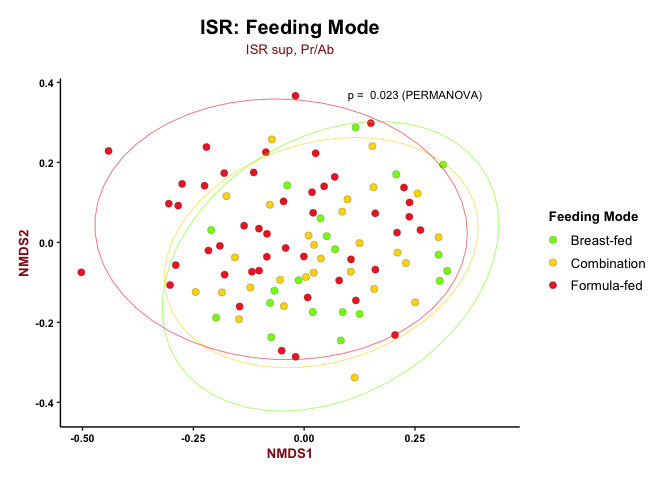

 

#### Feed Mode for Subgingival

``` r
# Subset sub counts for children's comparisons
ISR_sub_mch_prab_ch_comp <- ISR_sub_mch_prab[row.names(ISR_sub_mch_prab) %in% row.names(ISR_comb_ch_comp),]
ISR_sub_mch_prab_ch_comp <- ISR_sub_mch_prab_ch_comp[,colSums(ISR_sub_mch_prab_ch_comp) > 0]
dim(ISR_sub_mch_prab_ch_comp) # 94 x 1854
```

    ## [1]   94 1854

``` r
# Sanity check
all(row.names(ISR_sub_mch_prab_ch_comp) == ISR_comb_meta_ch$sample) # TRUE
```

    ## [1] TRUE

``` r
# Compute NMDS
set.seed(12345); ISR_sub_mch_prab_ch_comp.mds <- metaMDS(ISR_sub_mch_prab_ch_comp, trymax = 500, autotransform = F, wascores = F)
```

``` r
# Making dataframe for plotting
ISR_sub_mch_prab_ch_comp.mds.df <- data.frame(scores(ISR_sub_mch_prab_ch_comp.mds, display = 'sites'))
ISR_sub_mch_prab_ch_comp.mds.df$status <- ISR_comb_meta_mch$status[match(row.names(ISR_sub_mch_prab_ch_comp.mds.df), ISR_comb_meta_mch$sample)]
ISR_sub_mch_prab_ch_comp.mds.df$feed_mode <- ISR_comb_meta_mch$feed_mode[match(row.names(ISR_sub_mch_prab_ch_comp.mds.df), ISR_comb_meta_mch$sample)]
ISR_sub_mch_prab_ch_comp.mds.df$ch_age <- ISR_comb_meta_mch_ch$age[match(row.names(ISR_sub_mch_prab_ch_comp.mds.df), ISR_comb_meta_mch_ch$sample)]
ISR_sub_mch_prab_ch_comp.mds.df$subject_type <- ISR_comb_meta_mch_ch$subject_type[match(row.names(ISR_sub_mch_prab_ch_comp.mds.df), ISR_comb_meta_mch_ch$sample)]
# Permanova
set.seed(12345); (ISR_sub_mch_prab_ch_comp.perm_status <- adonis(formula = ISR_sub_mch_prab_ch_comp ~ ISR_sub_mch_prab_ch_comp.mds.df$status)) # 0.001 ***
```

    ## 
    ## Call:
    ## adonis(formula = ISR_sub_mch_prab_ch_comp ~ ISR_sub_mch_prab_ch_comp.mds.df$status) 
    ## 
    ## Permutation: free
    ## Number of permutations: 999
    ## 
    ## Terms added sequentially (first to last)
    ## 
    ##                                        Df SumsOfSqs MeanSqs F.Model
    ## ISR_sub_mch_prab_ch_comp.mds.df$status  1     0.593 0.59325  1.5352
    ## Residuals                              92    35.553 0.38644        
    ## Total                                  93    36.146                
    ##                                             R2 Pr(>F)    
    ## ISR_sub_mch_prab_ch_comp.mds.df$status 0.01641  0.001 ***
    ## Residuals                              0.98359           
    ## Total                                  1.00000           
    ## ---
    ## Signif. codes:  0 '***' 0.001 '**' 0.01 '*' 0.05 '.' 0.1 ' ' 1

``` r
set.seed(12345); (ISR_sub_mch_prab_ch_comp.perm_feed <- adonis(formula = ISR_sub_mch_prab_ch_comp ~ ISR_sub_mch_prab_ch_comp.mds.df$feed_mode)) # 0.023
```

    ## 
    ## Call:
    ## adonis(formula = ISR_sub_mch_prab_ch_comp ~ ISR_sub_mch_prab_ch_comp.mds.df$feed_mode) 
    ## 
    ## Permutation: free
    ## Number of permutations: 999
    ## 
    ## Terms added sequentially (first to last)
    ## 
    ##                                           Df SumsOfSqs MeanSqs F.Model
    ## ISR_sub_mch_prab_ch_comp.mds.df$feed_mode  2     0.866 0.43283  1.1164
    ## Residuals                                 91    35.280 0.38769        
    ## Total                                     93    36.146                
    ##                                                R2 Pr(>F)  
    ## ISR_sub_mch_prab_ch_comp.mds.df$feed_mode 0.02395  0.094 .
    ## Residuals                                 0.97605         
    ## Total                                     1.00000         
    ## ---
    ## Signif. codes:  0 '***' 0.001 '**' 0.01 '*' 0.05 '.' 0.1 ' ' 1

 

#### NMDS by Feed Mode (Subgingival)

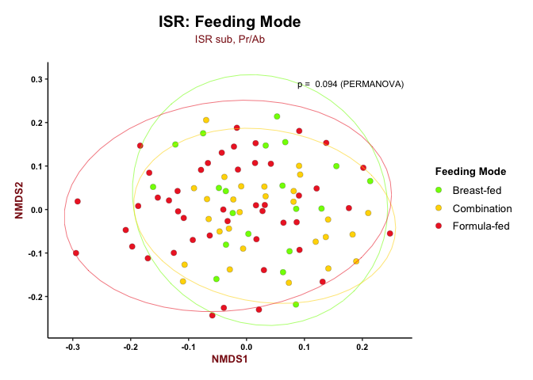

 

### Feed Mode by Saliva

``` r
# salset sal counts for children's comparisons
ISR_sal_mch_prab_ch_comp <- ISR_sal_mch_prab[row.names(ISR_sal_mch_prab) %in% row.names(ISR_comb_ch_comp),]
ISR_sal_mch_prab_ch_comp <- ISR_sal_mch_prab_ch_comp[,colSums(ISR_sal_mch_prab_ch_comp) > 0]
dim(ISR_sal_mch_prab_ch_comp) # 94 x 1854
```

    ## [1]   94 1118

``` r
# Sanity check
all(row.names(ISR_sal_mch_prab_ch_comp) == ISR_comb_meta_ch$sample) # TRUE
```

    ## [1] TRUE

``` r
# Compute NMDS
set.seed(12345); ISR_sal_mch_prab_ch_comp.mds <- metaMDS(ISR_sal_mch_prab_ch_comp, trymax = 500, autotransform = F, wascores = F)
```

``` r
# Making dataframe for plotting
ISR_sal_mch_prab_ch_comp.mds.df <- data.frame(scores(ISR_sal_mch_prab_ch_comp.mds, display = 'sites'))
ISR_sal_mch_prab_ch_comp.mds.df$status <- ISR_comb_meta_mch$status[match(row.names(ISR_sal_mch_prab_ch_comp.mds.df), ISR_comb_meta_mch$sample)]
ISR_sal_mch_prab_ch_comp.mds.df$feed_mode <- ISR_comb_meta_mch$feed_mode[match(row.names(ISR_sal_mch_prab_ch_comp.mds.df), ISR_comb_meta_mch$sample)]
ISR_sal_mch_prab_ch_comp.mds.df$ch_age <- ISR_comb_meta_mch_ch$age[match(row.names(ISR_sal_mch_prab_ch_comp.mds.df), ISR_comb_meta_mch_ch$sample)]
ISR_sal_mch_prab_ch_comp.mds.df$salject_type <- ISR_comb_meta_mch_ch$salject_type[match(row.names(ISR_sal_mch_prab_ch_comp.mds.df), ISR_comb_meta_mch_ch$sample)]

# Permanova
set.seed(12345); (ISR_sal_mch_prab_ch_comp.perm_status <- adonis(formula = ISR_sal_mch_prab_ch_comp ~ ISR_sal_mch_prab_ch_comp.mds.df$status)) # 0.001 ***
```

    ## 
    ## Call:
    ## adonis(formula = ISR_sal_mch_prab_ch_comp ~ ISR_sal_mch_prab_ch_comp.mds.df$status) 
    ## 
    ## Permutation: free
    ## Number of permutations: 999
    ## 
    ## Terms added sequentially (first to last)
    ## 
    ##                                        Df SumsOfSqs MeanSqs F.Model
    ## ISR_sal_mch_prab_ch_comp.mds.df$status  1    0.3196 0.31961  1.0239
    ## Residuals                              92   28.7178 0.31215        
    ## Total                                  93   29.0374                
    ##                                             R2 Pr(>F)
    ## ISR_sal_mch_prab_ch_comp.mds.df$status 0.01101  0.389
    ## Residuals                              0.98899       
    ## Total                                  1.00000

``` r
set.seed(12345); (ISR_sal_mch_prab_ch_comp.perm_feed <- adonis(formula = ISR_sal_mch_prab_ch_comp ~ ISR_sal_mch_prab_ch_comp.mds.df$feed_mode)) # 0.023
```

    ## 
    ## Call:
    ## adonis(formula = ISR_sal_mch_prab_ch_comp ~ ISR_sal_mch_prab_ch_comp.mds.df$feed_mode) 
    ## 
    ## Permutation: free
    ## Number of permutations: 999
    ## 
    ## Terms added sequentially (first to last)
    ## 
    ##                                           Df SumsOfSqs MeanSqs F.Model
    ## ISR_sal_mch_prab_ch_comp.mds.df$feed_mode  2    0.5391 0.26954  0.8607
    ## Residuals                                 91   28.4983 0.31317        
    ## Total                                     93   29.0374                
    ##                                                R2 Pr(>F)
    ## ISR_sal_mch_prab_ch_comp.mds.df$feed_mode 0.01857  0.853
    ## Residuals                                 0.98143       
    ## Total                                     1.00000

 

#### NMDS by Feed Mode (Saliva)

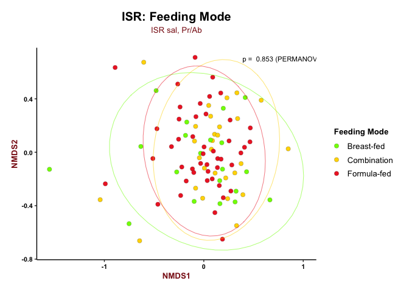

 

### Under 4

``` r
ISR_comb_meta_ch_u4 <- ISR_comb_meta_ch[ISR_comb_meta_ch$age < 4,]

# Subset Sup counts for children's comparisons
ISR_sup_mch_prab_ch_comp_u4 <- ISR_sup_mch_prab_ch_comp[row.names(ISR_sup_mch_prab_ch_comp) %in% ISR_comb_meta_ch_u4$sample,]
ISR_sup_mch_prab_ch_comp_u4 <- ISR_sup_mch_prab_ch_comp_u4[,colSums(ISR_sup_mch_prab_ch_comp_u4) > 0]
dim(ISR_sup_mch_prab_ch_comp_u4) # 62 x 857
```

    ## [1]   62 1083

``` r
# Check
all(row.names(ISR_sup_mch_prab_ch_comp_u4) == ISR_comb_meta_ch_u4$sample) # TRUE
```

    ## [1] TRUE

``` r
# Compute NMDS
set.seed(12345); ISR_sup_mch_prab_ch_comp_u4.mds <- metaMDS(ISR_sup_mch_prab_ch_comp_u4, trymax = 500, autotransform = F, wascores = F)
```

``` r
# Making dataframe for plotting
ISR_sup_mch_prab_ch_comp_u4.mds.df <- data.frame(scores(ISR_sup_mch_prab_ch_comp_u4.mds, display = 'sites'))
ISR_sup_mch_prab_ch_comp_u4.mds.df$status <- ISR_comb_meta_mch$status[match(row.names(ISR_sup_mch_prab_ch_comp_u4.mds.df), ISR_comb_meta_mch$sample)]
ISR_sup_mch_prab_ch_comp_u4.mds.df$feed_mode <- ISR_comb_meta_mch$feed_mode[match(row.names(ISR_sup_mch_prab_ch_comp_u4.mds.df), ISR_comb_meta_mch$sample)]
ISR_sup_mch_prab_ch_comp_u4.mds.df$ch_age <- ISR_comb_meta_mch_ch$age[match(row.names(ISR_sup_mch_prab_ch_comp_u4.mds.df), ISR_comb_meta_mch_ch$sample)]
ISR_sup_mch_prab_ch_comp_u4.mds.df$subject_type <- ISR_comb_meta_mch_ch$subject_type[match(row.names(ISR_sup_mch_prab_ch_comp_u4.mds.df), ISR_comb_meta_mch_ch$sample)]

# Permanova
set.seed(12345); (ISR_sup_mch_prab_ch_comp_u4.perm_feed <- adonis(formula = ISR_sup_mch_prab_ch_comp_u4 ~ ISR_sup_mch_prab_ch_comp_u4.mds.df$feed_mode)) # 0.006 **
```

    ## 
    ## Call:
    ## adonis(formula = ISR_sup_mch_prab_ch_comp_u4 ~ ISR_sup_mch_prab_ch_comp_u4.mds.df$feed_mode) 
    ## 
    ## Permutation: free
    ## Number of permutations: 999
    ## 
    ## Terms added sequentially (first to last)
    ## 
    ##                                              Df SumsOfSqs MeanSqs F.Model
    ## ISR_sup_mch_prab_ch_comp_u4.mds.df$feed_mode  2    1.0091 0.50454  1.3094
    ## Residuals                                    59   22.7344 0.38533        
    ## Total                                        61   23.7435                
    ##                                                  R2 Pr(>F)   
    ## ISR_sup_mch_prab_ch_comp_u4.mds.df$feed_mode 0.0425  0.006 **
    ## Residuals                                    0.9575          
    ## Total                                        1.0000          
    ## ---
    ## Signif. codes:  0 '***' 0.001 '**' 0.01 '*' 0.05 '.' 0.1 ' ' 1

 

#### NMDS by Feed Mode (Under 4)

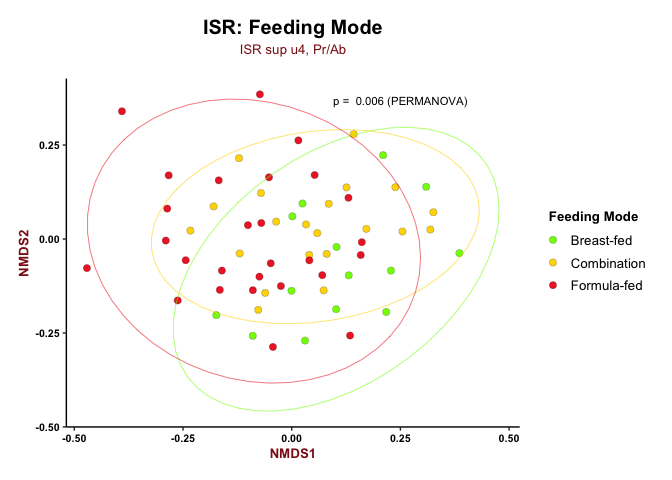

 

### Over 4

``` r
ISR_comb_meta_ch_o4 <- ISR_comb_meta_ch[ISR_comb_meta_ch$age > 4 ,]

# Subset Sup counts for children's comparisons
ISR_sup_mch_prab_ch_comp_o4 <- ISR_sup_mch_prab_ch_comp[row.names(ISR_sup_mch_prab_ch_comp) %in% ISR_comb_meta_ch_o4$sample,]
ISR_sup_mch_prab_ch_comp_o4 <- ISR_sup_mch_prab_ch_comp_o4[,colSums(ISR_sup_mch_prab_ch_comp_o4) > 0]
dim(ISR_sup_mch_prab_ch_comp_o4) # 32 x 703
```

    ## [1]  32 703

``` r
# Check
all(row.names(ISR_sup_mch_prab_ch_comp_o4) == ISR_comb_meta_ch_o4$sample) # TRUE
```

    ## [1] TRUE

``` r
# Compute NMDS
set.seed(12345); ISR_sup_mch_prab_ch_comp_o4.mds <- metaMDS(ISR_sup_mch_prab_ch_comp_o4, trymax = 500, autotransform = F, wascores = F)
```

``` r
# Making dataframe for plotting
ISR_sup_mch_prab_ch_comp_o4.mds.df <- data.frame(scores(ISR_sup_mch_prab_ch_comp_o4.mds, display = 'sites'))
ISR_sup_mch_prab_ch_comp_o4.mds.df$status <- ISR_comb_meta_mch$status[match(row.names(ISR_sup_mch_prab_ch_comp_o4.mds.df), ISR_comb_meta_mch$sample)]
ISR_sup_mch_prab_ch_comp_o4.mds.df$feed_mode <- ISR_comb_meta_mch$feed_mode[match(row.names(ISR_sup_mch_prab_ch_comp_o4.mds.df), ISR_comb_meta_mch$sample)]
ISR_sup_mch_prab_ch_comp_o4.mds.df$ch_age <- ISR_comb_meta_mch_ch$age[match(row.names(ISR_sup_mch_prab_ch_comp_o4.mds.df), ISR_comb_meta_mch_ch$sample)]
ISR_sup_mch_prab_ch_comp_o4.mds.df$subject_type <- ISR_comb_meta_mch_ch$subject_type[match(row.names(ISR_sup_mch_prab_ch_comp_o4.mds.df), ISR_comb_meta_mch_ch$sample)]

# Permanova
set.seed(12345); (ISR_sup_mch_prab_ch_comp_o4.perm_feed <- adonis(formula = ISR_sup_mch_prab_ch_comp_o4 ~ ISR_sup_mch_prab_ch_comp_o4.mds.df$feed_mode)) # 0.49
```

    ## 
    ## Call:
    ## adonis(formula = ISR_sup_mch_prab_ch_comp_o4 ~ ISR_sup_mch_prab_ch_comp_o4.mds.df$feed_mode) 
    ## 
    ## Permutation: free
    ## Number of permutations: 999
    ## 
    ## Terms added sequentially (first to last)
    ## 
    ##                                              Df SumsOfSqs MeanSqs F.Model
    ## ISR_sup_mch_prab_ch_comp_o4.mds.df$feed_mode  2    0.7832 0.39158 0.99384
    ## Residuals                                    29   11.4261 0.39400        
    ## Total                                        31   12.2092                
    ##                                                   R2 Pr(>F)
    ## ISR_sup_mch_prab_ch_comp_o4.mds.df$feed_mode 0.06414   0.49
    ## Residuals                                    0.93586       
    ## Total                                        1.00000

 

#### NMDS by Feed Mode (Over 4)

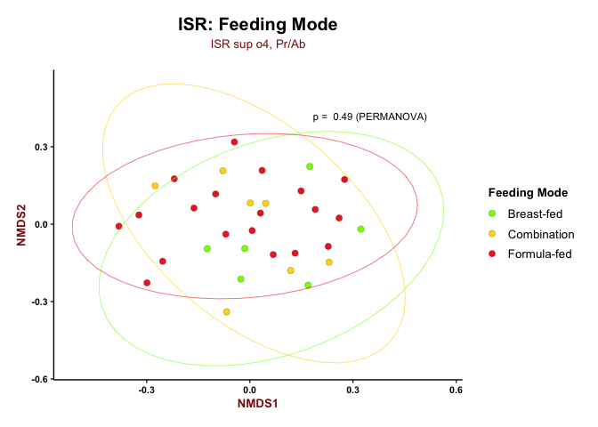
