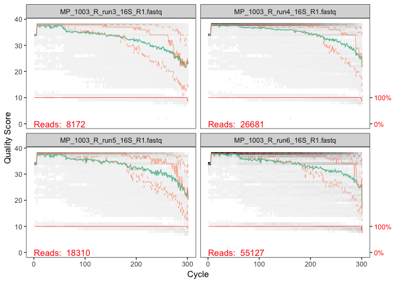
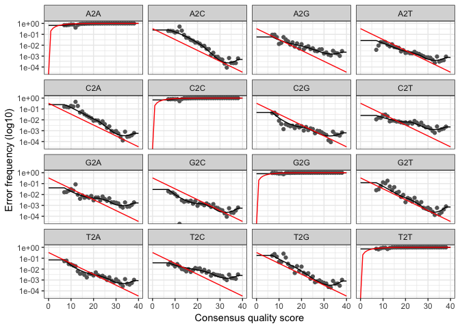

V12 DADA2 Processing
================
Troy Ellison
4/23/2019

Experiment Notes
----------------

Script for processing 16S V1-V2 Longitudinal "Right" side samples with DADA2

 

Environment Notes
-----------------

R version 3.4.0 (2017-04-21) -- "You Stupid Darkness" Platform: x86\_64-apple-darwin15.6.0 (64-bit) RStudio Version 1.0.143

 

### Initial Setup

#### Set Working Directory

``` r
setwd("/Volumes/GriffenLeysLab/Troy/ISR_manuscript_markdown/V12_DADA2")
```

#### Load Required Libraries

``` r
# Load required libraries:
library(dada2); packageVersion("dada2")
library(data.table)
library(phyloseq)
```

#### Set seed and DADA2 Options

``` r
# Inspect current DADA2 options
getDadaOpt()
# Using default DADA2 options

# Set seed
set.seed(12345)
```

 

### Create Sample Names

``` r
# Assign path to unzipped forward Fastq files:
path <- "/Volumes/GriffenLeysLab/Ran/ISR_2018/v12_dada/ISR_long_R_16S_fastqs" # directory of zipped forward FASTQ files
list.files(path)

# Assign full path names & verify
fnFs <- sort(list.files(path, pattern="_R1.fastq", full.names = TRUE))
fnFs

# Assign sample names & verify
sample.names <- as.vector(sapply(basename(fnFs),function(x){y <- strsplit(x,"_")[[1]];paste(y[2:4],collapse="_")}))
sample.names
```

 

### Quality Plots



 

### Filter Reads

``` r
#Filter forward reads
filt_path <- file.path(path, "filtered") # Place filtered files in filtered/ subdirectory
filtFs <- file.path(filt_path, paste0(sample.names, "_F_filt.fastq.gz"))

# Forward primer used is 27f, "AGAGTTTGATYMTGGCTCAG" which is 20 bases
# Filter the forward reads:
# Based on quality plots, truncLen set to 295 and based on primer size trimLeft set to 20
out <- filterAndTrim(fnFs, filtFs, truncLen=295, trimLeft=20,
                     maxN=0, maxEE=2, truncQ=2, rm.phix=TRUE,
                     compress=TRUE, multithread=TRUE)
```

 

### Learn and Plot Error Rates

``` r
# Learn Error rates
errF <- learnErrors(filtFs, multithread=TRUE)
```

    ## 108272450 total bases in 393718 reads from 16 samples will be used for learning the error rates.

``` r
# Plot Errors
plotErrors(errF, nominalQ=TRUE)
```



 

### Dereplicate and Denoise

``` r
#Dereplicate the filtered fastq files:
derepFs <- derepFastq(filtFs, verbose=TRUE)

# Name the derep-class objects by the sample names
names(derepFs) <- sample.names

# De-noise sequences & inspect object
dadaFs <- dada(derepFs, err=errF, multithread=TRUE)
dadaFs[[1]]

#Make sequence table without merging
seqtabF <- makeSequenceTable(dadaFs)
dim(seqtabF)
#[1]   30 2230
```

 

### Remove Chimeras

``` r
seqtabF.nochim <- removeBimeraDenovo(seqtabF, method="consensus", multithread=TRUE, verbose=TRUE)
```

    ## Identified 337 bimeras out of 2269 input sequences.

``` r
# Identified 309 bimeras out of 2230 input sequences.
dim(seqtabF.nochim)
```

    ## [1]   30 1932

``` r
#[1]   30 1921

sum(seqtabF.nochim)/sum(seqtabF)
```

    ## [1] 0.9729307

``` r
# [1] 0.9731952
```

 

### Generate DADA2 Stats and ASV Table

``` r
# Inspect distribution of sequence lengths
table(nchar(getSequences(seqtabF.nochim)))
```

    ## 
    ##  275 
    ## 1932

``` r
# 275 1921

# Generate stats for DADA2
getN <- function(x) sum(getUniques(x))
track <- cbind(out, sapply(dadaFs, getN), rowSums(seqtabF), rowSums(seqtabF.nochim))
colnames(track) <- c("input", "filtered", "denoised", "tabled","nochim")
rownames(track) <- sample.names
dada2_16S_stats <- as.data.frame(track)
write.table(dada2_16S_stats, file="16S_DADA2stats.txt", sep="\t", quote=F, col.names = NA)

#Making ASV table:
atab <- otu_table(seqtabF.nochim, taxa_are_rows=FALSE)
colnames(atab) <- paste0("seq", seq(ncol(atab)))
V12_long_R.atab <- as.data.frame(atab)

dim(V12_long_R.atab)
```

    ## [1]   30 1932

``` r
#[1]   30 1921
```

 

### Rename for Analysis

``` r
# Rename for analysis:
rownames(V12_long_R.atab) <- sub("_R_run3", "_T1", rownames(V12_long_R.atab))
rownames(V12_long_R.atab) <- sub("_R_run4", "_T2", rownames(V12_long_R.atab))
rownames(V12_long_R.atab) <- sub("_R_run5", "_T3", rownames(V12_long_R.atab))
rownames(V12_long_R.atab) <- sub("_R_run6", "_T4", rownames(V12_long_R.atab))
rownames(V12_long_R.atab) <- sub("_R_run7", "_T5", rownames(V12_long_R.atab))
rownames(V12_long_R.atab) <- sub("_R_run8", "_T6", rownames(V12_long_R.atab))
rownames(V12_long_R.atab) <- sub("1003_", "S1_", rownames(V12_long_R.atab))
rownames(V12_long_R.atab) <- sub("1004_", "S2_", rownames(V12_long_R.atab))
rownames(V12_long_R.atab) <- sub("1006_", "S3_", rownames(V12_long_R.atab))
rownames(V12_long_R.atab) <- sub("1007_", "S4_", rownames(V12_long_R.atab))
rownames(V12_long_R.atab) <- sub("2002_", "S5_", rownames(V12_long_R.atab))
```
