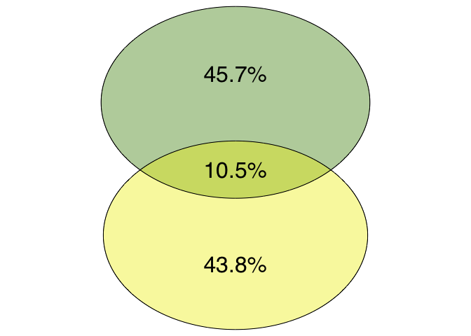
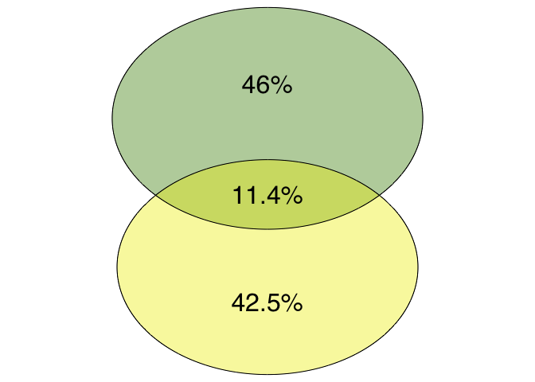
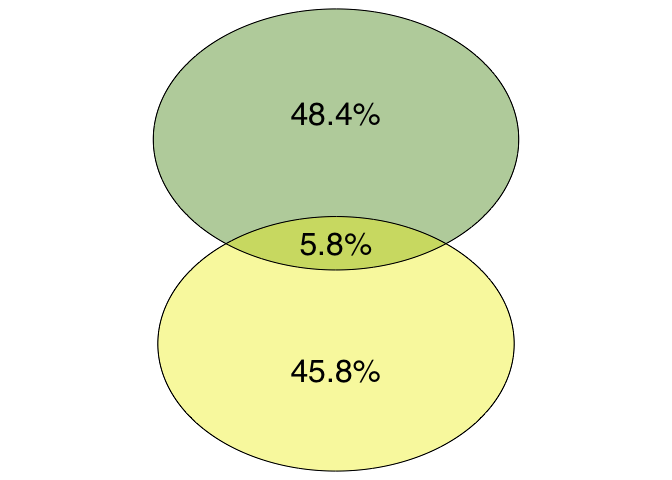
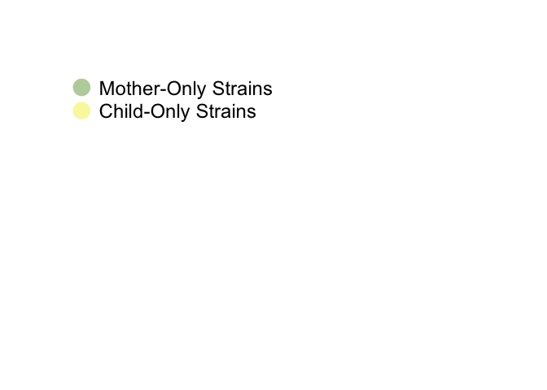

Supragingival Mother-Child Matching
================
Troy Ellison
5/6/2019

Script Notes
============

This script takes Mother-Child Pair Combinations of supragingival samples and output
1. How many sequences the Mother-Child pair share
2. How many sequences are present in the mother's sample only
3. How many sequences are present in the child's sequence only
These statistics are then separated based on the Mother-Child relations (Biological, Adopted, or differrent family), then displayed in venn diagrams

 

Environment Notes
=================

Run in R Studio 1.0.153 Using R version 3.5.2 (2018-12-20) -- "Eggshell Igloo" Copyright (C) 2018 The R Foundation for Statistical Computing Platform: x86\_64-apple-darwin15.6.0 (64-bit)

 

### Load Required Libraries

``` r
library(dplyr)
library(data.table)
library(vegan)
library(VennDiagram)
library(ggplot2)
```

 

### Load Required R Objects

``` r
load("/Volumes/GriffenLeysLab/Troy/site_venn/ISR_sup_mch_prab.rds")
load("/Volumes/GriffenLeysLab/Troy/ISR_comb_meta_mch.rds")
```

 

Mother-Child Matching
---------------------

 

### Create subset tables of mother sequences and child sequences

``` r
ISR_comb_meta_mch_m <- ISR_comb_meta_mch[ISR_comb_meta_mch$subject_type == "Biological Mother" | ISR_comb_meta_mch$subject_type == "Adopted Mother",]
ISR_comb_meta_mch_c <- ISR_comb_meta_mch[ISR_comb_meta_mch$subject_type == "Biological Child" | ISR_comb_meta_mch$subject_type == "Adopted Child",]
sup.ISR.mother <- ISR_sup_mch_prab[rownames(ISR_sup_mch_prab) %in% ISR_comb_meta_mch_m$sample, ]
sup.ISR.child <- ISR_sup_mch_prab[rownames(ISR_sup_mch_prab) %in% ISR_comb_meta_mch_c$sample, ]
```

 

### Construct Dataframe for Mother-Child combinations

``` r
sup.ISR.matches <- data.frame(Mother = character(),
                          Child = character(),
                          Matches = integer(),
                          MotherOnly = integer(),
                          ChildOnly = integer())
```

 

### Fill Dataframe with Mother-Child combinations

``` r
#Loop through the mother and child subtables
for(mother in 1:nrow(sup.ISR.mother)){
  for(child in 1:nrow(sup.ISR.child)){
    
    #Set sequence counters for matched, mother only and child only    
    matched <- 0
    motherOnly <- 0
    childOnly <- 0
    
    #Loop through each row in the mother subtable    
    for(seq in 1:ncol(sup.ISR.mother)){
      
      #Check if the mother and/or child is positive for the sequence
      if(sup.ISR.child[child, seq] == sup.ISR.mother[mother,seq] && sup.ISR.mother[mother,seq]==1 ){
        
        #If both positive, increment the matched counter
        matched <- matched+1
        
        #If mother only positive, increment the mother only counter
      } else if(sup.ISR.mother[mother,seq] == 1){
        motherOnly <- motherOnly+1
        
        #If child only positive, increment the child only counter
      } else if(sup.ISR.child[child, seq] == 1){
        childOnly <- childOnly+1
      }
    }
    
    #Create a new row of the mother-child combination with the matched, mother-only, and child-only counters,
    #and bind it to the matches dataframe
    ISR.row <- data.frame(rownames(sup.ISR.mother[mother,]), rownames(sup.ISR.child[child,]), matched, motherOnly, childOnly)
    sup.ISR.matches <- rbind(sup.ISR.matches, ISR.row)
  }
  
}
```

 

Venn Diagram Plotting
---------------------

 

### Adding Family Info and Subset Sequences of the Same Family

``` r
# Combining loop results
colnames(sup.ISR.matches) <- c("Sub1","Sub2","Shared","Sub1_only","Sub2_only")
View(sup.ISR.matches)

# Add family info
sup.ISR.matches$fam_id1 <- ISR_comb_meta_mch$family_id[match(sup.ISR.matches$Sub1, ISR_comb_meta_mch$sample)]
sup.ISR.matches$fam_id2 <- ISR_comb_meta_mch$family_id[match(sup.ISR.matches$Sub2, ISR_comb_meta_mch$sample)]
sup.ISR.matches$fam <- "Same Family"
sup.ISR.matches[sup.ISR.matches$fam_id1 != sup.ISR.matches$fam_id2,]$fam <- "Different Family"

# Subset same fam
sup.ISR.matches_sf <- sup.ISR.matches[sup.ISR.matches$fam == "Same Family",]
colnames(sup.ISR.matches_sf) <- c("Sub1","Sub2","Shared","Mother_only","Child_only", "fam_id1","fam_id2","fam")
View(sup.ISR.matches_sf)

# Add adoption status 
sup.ISR.matches_sf$status <- ISR_comb_meta_mch$status[match(sup.ISR.matches_sf$fam_id1, ISR_comb_meta_mch$family_id)]
```

 

### Create Dataframe for Biological Mother-Child Pairs

``` r
# Subset for Biological
sup.ISR.matches_sf_bio <- sup.ISR.matches_sf[sup.ISR.matches_sf$status == "Biological",]
View(sup.ISR.matches_sf_bio)
nrow(sup.ISR.matches_sf_bio) # 54
```

    ## [1] 54

``` r
# Extract columns for plotting
sup.ISR_strncnt_sf_bio <- sup.ISR.matches_sf_bio[,c("fam_id1", "Shared","Mother_only","Child_only")]

# Clean up table for computing %
row.names(sup.ISR_strncnt_sf_bio) <- sup.ISR_strncnt_sf_bio$fam_id1
sup.ISR_strncnt_sf_bio$fam_id1 <- NULL
View(sup.ISR_strncnt_sf_bio)

# Convert to numeric
sup.ISR_strncnt_sf_bio$Shared <- as.numeric(as.character(sup.ISR_strncnt_sf_bio$Shared))
sup.ISR_strncnt_sf_bio$Child_only <- as.numeric(as.character(sup.ISR_strncnt_sf_bio$Child_only))
sup.ISR_strncnt_sf_bio$Mother_only <- as.numeric(as.character(sup.ISR_strncnt_sf_bio$Mother_only))

# Conver to %
sup.ISR_strncnt_sf_bio.pct <- decostand(sup.ISR_strncnt_sf_bio, method = "total")

# Create df for plotting
sup.bio_pie_df <- data.frame(
  group = c("Shared", "Child Only", "Mother Only"),
  value = c(mean(sup.ISR_strncnt_sf_bio.pct$Shared)*100, mean(sup.ISR_strncnt_sf_bio.pct$Child_only)*100, mean(sup.ISR_strncnt_sf_bio.pct$Mother_only)*100)
)
```

 

### Create Dataframe for Adopted Mother-Child Pairs

``` r
# Subset for Adopted
sup.ISR.matches_sf_adp <- sup.ISR.matches_sf[sup.ISR.matches_sf$status == "Adopted",]
View(sup.ISR.matches_sf_adp)
nrow(sup.ISR.matches_sf_adp) # 43
```

    ## [1] 43

``` r
# Extract columns for plotting
sup.ISR_strncnt_sf_adp <- sup.ISR.matches_sf_adp[,c("fam_id1", "Shared","Mother_only","Child_only")]

# Clean up table for computing %
row.names(sup.ISR_strncnt_sf_adp) <- sup.ISR_strncnt_sf_adp$fam_id1
sup.ISR_strncnt_sf_adp$fam_id1 <- NULL
View(sup.ISR_strncnt_sf_adp)

# Convert to numeric
sup.ISR_strncnt_sf_adp$Shared <- as.numeric(as.character(sup.ISR_strncnt_sf_adp$Shared))
sup.ISR_strncnt_sf_adp$Child_only <- as.numeric(as.character(sup.ISR_strncnt_sf_adp$Child_only))
sup.ISR_strncnt_sf_adp$Mother_only <- as.numeric(as.character(sup.ISR_strncnt_sf_adp$Mother_only))

# Conver to %
sup.ISR_strncnt_sf_adp.pct <- decostand(sup.ISR_strncnt_sf_adp, method = "total")

# Create df for plotting
sup.adp_pie_df <- data.frame(
  group = c("Shared", "Child Only", "Mother Only"),
  value = c(mean(sup.ISR_strncnt_sf_adp.pct$Shared)*100, mean(sup.ISR_strncnt_sf_adp.pct$Child_only)*100, mean(sup.ISR_strncnt_sf_adp.pct$Mother_only)*100)
)
```

 

### Create Dataframe for Different Family Mother-Child Pairs

``` r
# Subset diff fam
sup.ISR.matches_df <- sup.ISR.matches[sup.ISR.matches$fam == "Different Family",]
View(sup.ISR.matches_df)

# Add adoption status 
sup.ISR.matches_df$sub_type1 <- ISR_comb_meta_mch$subject_type[match(sup.ISR.matches_df$Sub1, ISR_comb_meta_mch$sample)]
sup.ISR.matches_df$sub_type2 <- ISR_comb_meta_mch$subject_type[match(sup.ISR.matches_df$Sub2, ISR_comb_meta_mch$sample)]

# Remove bio/adp from sub type
sup.ISR.matches_df$sub_type1 <- gsub("Biological ", "", sup.ISR.matches_df$sub_type1)
sup.ISR.matches_df$sub_type1 <- gsub("Adopted ", "", sup.ISR.matches_df$sub_type1)
sup.ISR.matches_df$sub_type2 <- gsub("Biological ", "", sup.ISR.matches_df$sub_type2)
sup.ISR.matches_df$sub_type2 <- gsub("Adopted ", "", sup.ISR.matches_df$sub_type2)

# Add rel field
sup.ISR.matches_df$rel <- paste(sup.ISR.matches_df$sub_type1, sup.ISR.matches_df$sub_type2, sep="_")

# Select mother-child only
sup.ISR.matches_df_mc <- sup.ISR.matches_df[sup.ISR.matches_df$rel != "Child_Child" & sup.ISR.matches_df$rel != "Mother_Mother",]
View(sup.ISR.matches_df_mc)
sup.ISR.matches_df_mc$rel %>% unique # "Child_Mother" "Mother_Child"
```

    ## [1] "Mother_Child"

``` r
# Separate "Child_Mother" and "Mother_Child" for re-ordering fields
sup.ISR.matches_df_mc1 <- sup.ISR.matches_df_mc[sup.ISR.matches_df_mc$rel == "Child_Mother",]
sup.ISR.matches_df_mc2 <- sup.ISR.matches_df_mc[sup.ISR.matches_df_mc$rel == "Mother_Child",]

# Subset columns
sup.ISR.matches_df_mc1 <- sup.ISR.matches_df_mc1[,c("Sub1", "Sub2", "Shared","Sub1_only","Sub2_only")]
sup.ISR.matches_df_mc2 <- sup.ISR.matches_df_mc2[,c("Sub1", "Sub2", "Shared","Sub1_only","Sub2_only")]

# Rename columns
colnames(sup.ISR.matches_df_mc1) <- c("Sub1","Sub2","Shared","Child_only","Mother_only")
colnames(sup.ISR.matches_df_mc2) <- c("Sub1","Sub2","Shared","Mother_only","Child_only")

# Re-order columns for mc2
sup.ISR.matches_df_mc2 <- sup.ISR.matches_df_mc2[,c(1,2,3,5,4)]

# Combine mc1 and mc2
sup.ISR.matches_df_mc_comb <- rbind.data.frame(sup.ISR.matches_df_mc1, sup.ISR.matches_df_mc2)
sup.ISR_strncnt_diffam <- sup.ISR.matches_df_mc_comb[,c(3:5)]

# Convert to numeric
sup.ISR_strncnt_diffam$Shared <- as.numeric(as.character(sup.ISR_strncnt_diffam$Shared))
sup.ISR_strncnt_diffam$Child_only <- as.numeric(as.character(sup.ISR_strncnt_diffam$Child_only))
sup.ISR_strncnt_diffam$Mother_only <- as.numeric(as.character(sup.ISR_strncnt_diffam$Mother_only))

# Conver to %
sup.ISR_strncnt_diffam.pct <- decostand(sup.ISR_strncnt_diffam, method = "total")

# Create df for plotting
sup.diffam_pie_df <- data.frame(
  group = c("Shared", "Child Only", "Mother Only"),
  value = c(round(mean(sup.ISR_strncnt_diffam.pct$Shared)*100,1), mean(sup.ISR_strncnt_diffam.pct$Child_only)*100, mean(sup.ISR_strncnt_diffam.pct$Mother_only)*100)
)
```

 

Venn Diagrams
-------------

 

### Biological Mother-Child Pairs



 

### Adopted Mother-Child Pairs



 

### Different Family Mother-Child Pairs



 

### Legend


